# 10.1 软件架构的演化和维护-演化和定义的关系

## 1. 软件可靠性定义

        软件架构的演化和维护是为了使软件能够使用环境的变化而进行的纠错性修改和完善性修改。
        软件架构哦的演化和维护过程是一个不断迭代的过程，通过演化和维护，软件架构逐步得到完善，以满足用户需求。
        软件架构的演化就是软件整体结构的演化，演化过程涵盖软件架构的全生命周期，包括软件架构需求的获取、软件架构建模、软件架构文档、软件架构实现以及软甲架构维护等阶段。所以，人们通常说软件架构是演化来的，而不是设计来的。

        软件架构定义是SA=[组件，连接件，约束]，这类软件架构演化主要关注的就是组件、连接件和约束的添加、修改与删除等
        - 组件是软件架构的基本要素和结构单元，表示系统中主要的计算元素、数据存储以及一些重要模块，当需要消除软件架构存在的缺陷、新增功能、适应新的环境时都涉及组件的演化。组件的演化体现在组件中模块的增加、删除或修改。
        - 连接件是组件间的交互关系，多数情况下组件的演化牵涉到连接件的演化。连接件的演化体现在组件交互消息的增加、删除或改变
        - 约束是组件和连接件之间的拓扑关系和配置，它为组件和连接件提供额外数据支撑，可以是架构的约束数据，或架构的参数理

# 10.2 软件架构的演化和维护-面向对象的软件架构演化过程【了解性内容】

# 10.3 软件架构的演化和维护-架构演化方式的分类

        软件架构演化典型的分类方法
        (1)按照软件架构的实现方式和实施粒度分类:基于过程和函数的演化、面向对象的演化、基于组件的演化和基于架构的演化
        (2)按照研究方法将软件架构演化方式分为4类:
        - 第1类是对演化的支持，如代码模块化的准则、可维护性的支持(如内聚和羯合)代码重构等;
        - 第2类是版本和工程的管理工具，如CVS 和COCOMO
        - 第3类是架构变换的形式方法，包括系统结构和行为变换的模型以及架构演化的重现风格等;
        - 第4类是架构演化的成本收益分析决定如何增加系统的弹性
        (3)针对软件架构的演化过程是否处于系统运行时期，将软架构演化分为静态演化和动态演化。
        - 静态演化发生在软件架构的设计、实现和维护过程中，  软件系统还未运行或者处在运行停止状态
        - 动态演化发生在软件系统运行过程中

## 1. 架构演化时期

        1.设计时演化
        设计时演化是指发生在体系结构模型和与之相关的代码编译之前的软件架构演化。
        
        2.运行前演化
        运行前演化是指发生在编译之后、执行之前的软件架构演化，这时由于应用程序并未执行，修改时不用考虑应用程序的状态，但需要考虑系统的体系结构，且系统需要具有添加和删除组件的机制。

        3.有限制运行时演化
        有限制运行时演化是指系统在设计时就规定了演化的具体条件将系统置于“安全”模式下，演化只发生在某些特定约束满足时可以进行一些规定好的演化操作。
        
        4.运行时演化
        运行时演化是指系统的体系结构在运行时不能满足要求时发生的软件架构演化，包括添加组件、删除组件、升级替换组件、改变体系结构的拓扑结构等。此时的演化是最难实现的.

## 2. 软件架构静态演化

### 2.1 静态演化需求
       
        软件架构静态演化的需求是广泛存在的，可归结为两个方面：
        (1)设计时演化需求。在架构开发和实现过程中对原有架构进行调整，保证软件实现与架构的一致性以及软件开发过程的顺利进行
        (2)运行前演化需求。软件发布之后由于运行环境的变化，需要对软件进行修改升级，在此期间软件的架构同样要进行演化

### 2.2 静态演化的一般过程

        软件静态演化是系统停止运行期间的修改和更新，即一般意义上的软件修复和升级。与此时相对应的维护方法有三类:更正性维护、适应性维护、完善性维护软件的静态演化包括如下 5 个步骤:
        - 软件理解:查阅软件文档，分析软件架构，识别系统组成元素及其之间的相互关系，提取系统的抽象表示形式
        - 需求变更分析:静态演化往往是由于用户需求变化、系统运行出错和运行环境发生改变等原因所引起的，需要找出新的软件需求和原有的差异。
        - 演化计划: 分析原系统，确定演化范围和成本，选择合适的演化计划。
        - 系统重构:根据演化计划对系统进行重构，使之适应当前的需
        - 系统测试:对演化后的系统进行测试，查找其中的错误和不足

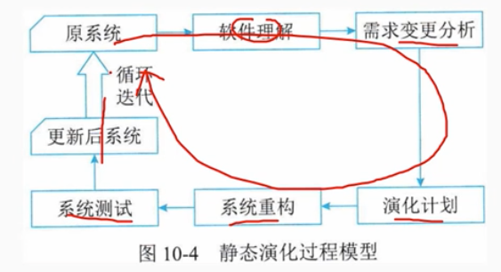

## 3. 软件架构动态演化

        动态演化是在系统运行期间的演化，在不停止系统功能的情况下完成演化，较之静态演化更加困难。具体发生在有限制的运行时演化和运行时演化阶段

### 3.1 动态演化的类型

        （1）软件动态性的三个等级
        - 交互动态性，要求数据在固定的结构下动态交互。
        - 结构动态性，允许对结构进行修改，通常形式是组件和连接件实例的添加和删除，这种动态性是研究和应用的主流
        - 架构动态性，允许软件架构的基本构造变动，即结构可以被重定义，如新的组件类型的定义

        (2)动态演化的内容
        根据所修改的内容不同，软件的动态演化包括以下 4 个方面:
        - 属性改名:目前所有的ADL都支持对非功能属性的分析和规约而在运行过程中，用户可能会对这些指标进行重新定义(如服务响应时间)。
        - 行为变化:在运行过程中，用户需求变化或系统自身服务质量的调节都将引发软件行为的变化。如，为了提高安全级别而更换加密算法;将HTTP协议改为HTTPS协议
        - 拓扑结构改变:如增删组件，增删连接件，改变组件与连接件之间的关联关系等
        - 风格变化:一般软件演化后其架构风格应当保持不变，如果非要改变软件的架构风格也只能将架构风格变为衍生风格。如将两层c/S结构调整为三层c/S结构等。

# 10.4 软件架构的演化和维护-架构演化原则

## 1. 架构演化原则

        列举 18 种软件架构可持续演化原则，并针对每个原则设计了相应的度量方案。每个方案都能紧抓该原则的本质，做到从架构方面提供有价值的信息，帮助对架构进行有效观察

### 1.1 演化成本控制原则

        原则名称: 演化成本控制(ECC)原则。
        原则解释:演化成本要控制在预期的范围之内，也就是演化成本要明显小于重新开发成本。
        原则用途: 用于判断架构演化的成本是否在可控范围内，以及用户是否可接受
        度量方案: CoE<<CORD。
        方案说明: COE为演化成本，CORD为重新开发成本，COE远小于CORD最佳

### 1.2 进度可控原则

        原则名称:进度可控原则
        原则解释:架构演化要在预期时间内完成，也就是时间可控
        原则用途: 根据该原则可以规划每个演化过程的任务量，体现种迭代、递增(持续演化)的演化思想。
        度量方案:: ttask=|Ttask-T'task|
        方案说明: 某个演化任务的实际完成时间(Ttask) 和预期完成时间(T'task)的时间差ttask越小越好。

### 1.3 风险可控原则

        原则名称: 风险可控原则
        原则解释:架构演化过程中的经济风险、时间风险、人力风险技术风险和环境风险等必须在可控范围内。
        原则用途: 用于判断架构演化过程中各种风险是否易于控制
        度量方案:分别检验
        方案说明: 时间风险、经济风险、人力风险、技术风险都不存在。

### 1.4 主题维持原则

        原则名称:主体维持原则
        原则解释:对称稳定增长(AIG)原则所有其他因素须与软件演化协调，开发人员、销售人员、用户必须熟悉软件演化的内容从而达到令人满意的演化。因此，软件演化的亚均增量的增长须保持平稳，保证软件系统主体行为稳定
        原则用途：用于判判断架构演化是否导致系统主体行为不稳定
        度量方案:计算AIG即可，AIG=主体规模的变更量/主体的规模
        方案说明: 根据度量动态变更信息(类型、总量、范围) 来计算

### 1.5 系统总体结构优化原则
        
        原则名称:系统总体结构优化原则
        原则解释:架构演化要遵循系统总体结构优化原则，使得演化之后的软件系统整体结构(布局)更加合理
        原则用途: 用于判断系统整体结构是否合理，是否最优。度量方案:检查系统的整体可靠性和性能指标
        方案说明:判断整体结构优分的主要指标是系统的可靠性和性能。

### 1.6 平滑演化原则

        原则名称:平滑演化(IWR)原则
        原则解释:在软件系统的生命周期里，软件的演化速率趋于稳定，如相邻版本的更新率相对固定,
        原则用途: 用于判断是否存在剧烈架构演化。
        度量方案: 计算IWR即可，IWR=变更总量/项目规模.
        方案说明:根据度量动态变更信息(类型、总量、范围等) 来计算。

### 1.7 目标一致原则

        原则名称: 目标一致原则
        架构演化的阶段目标和最终目标要一致原则解释:原则用途: 用于判断每个演化过程是否达到阶段目标，所有演化过程结束是否能达到最终目标.
        度量方案: otask=|Otask-O'task|
        方案说明: 阶段目标的实际达成情况(Otask) 和预期目标(O'task)的差otask越小越好。

### 1.8 模块独立演化原则

        原则名称: 模块独立演化原则，或修改局部化原则
        原则解释: 软件中各模块(相同制品的模块，如Java的某个类或包)自身的演化最好相互独立，或者至少保证对其他模块的影响比较小或影响范围比较小
        原则用途: 用于判断每个模块自身的演化是否相互独立
        度量方案: 检查模块的修改是否是局部的.
        方案说明: 可以通过计算修改的影响范围来进行度量

### 1.9 影响可控原则

        原则名称: 影响可控原则
        原则解释: 软件中一个模块如果发生变更，其给其他模块带来的影响要在可控范围内也就是影响范围可预测
        原则用途: 用于判断是否存在对某个模块的修改导致大量其他修改的情况。
        度量方案: 检查影响的范围是否可控
        方案说明: 通过计算修改的影响范围来进行度量.

### 1.10 复杂性可控原则

        原则名称: 复杂性可控(CC)原则
        原则解释: 架构演化必须要控制架构的复杂性”从而进一步保障软件的复杂性在可控范围内。
        原则用途: 用于判断演化之后的架构是否易维护、易扩展、易分析、易测试等
        度量方案: CC小于某个闽值.
        方案说明: Cc增长可控

### 1.11 有利于重构原则

        原则名称: 有利于重构原则。
        原则解释: 架构演化要遵循有利于重构原则，使得演化之后的软件架构更方便重构。
        原则用途: 用于判断架构易重构性是否得到提高
        度量方案: 检查系统的复杂度指标
        方案说明: 系统越复杂越不容易重构

### 1.12 有利于重用原则

        原则名称: 有利于重用原则
        原则解释: 架构演化最好能维持，甚至提高整体架构的可重用性
        原则用途: 用于判断整体架构可重用性是否遭到破坏
        度量方案: 检查模块自身的内聚度、模块之间的耦合度.
        方案说明: 模块的内聚度越高，该模块与其他模块之间的耦合度越低，越容易重用.

### 1.13 设计原则遵从性原则

        原则名称: 设计原则遵从性原则
        原则解释: 架构演化最好不能与架构设计原则冲突
        原则用途: 用于判断架构设计原则是否遭到破坏(架构设计原则是好的设计经验总结，要保障其得到充分使用)。
        度量方案: RCP=|CDP|/|DP|
        方案说明: 冲突的设让原则集合(CDP) 和总的设计原则集合(DP)的比较，RCP越小越好。

### 1.14 适应新技术原则

        原则名称: 适应新技术(TI) 原则
        原则解释: 软件要独立于特定的技术手段，这样才能够让软件运行于不同平台
        原则用途: 用于判断架构演化是否存在对某种技术依赖过强的情况。
        度量方案: TI=1-DDT，DDT=|依赖的技术集合|/|用到的技术合集|。
        方案说明: 根据演化系统对关键技术的依赖程度进行度量

### 1.15 环境适应性原则

        原则名称: 环境适应性原则
        原则解释: 架构演化后的软件版本能够比较容易适应新的硬件环境与软件环境。
        原则用途: 用于判断架构在不同环境下是否仍然可使用，或者容易进行环境配置。
        度量方案: 硬件/软件兼容性
        方案说明: 结合软件质量中兼容性指标进行度量

### 1.16 标准依从性原则

        原则名称: 标准依从性原则
        原则解释: 架构演化不会违背相关质量标准(国际标准、国家标准、行业标准、企业标准等)。
        原则用途: 用于判断架构演化是否具有规范性，是否有章可循而不是胡乱或随意地演化
        度量方案: 需要人工判定

### 1.17 质量向好原则

        原则名称:_质量向好(Ql)原则
        原则解释: 通过演化使得所关注的某个质量指标或某些质量指标的综合效果变得更好或者更满意，例如可靠性提高了原则用途: 用于判断架构演化是否导致某些质量指标变得很差
        度量方案: EQI>SQ。
        方案说明:演化之后的质量(EQI) 比原来的质量(SQ) 要好

### 1.18 适应新需求原则

        原则名称: 适应新需求原则。
        原则解释: 架构演化要容易适应新的需求变更，架构演化不能降低原有架构适应新需求的能力;架构演化最好可以提高适应新需求的能力。
        原则用途: 用于判断演化之后的架构是否降低了架构适应新需求的能力。
        度量方案: RNR=|ANR|/|NR|。
        方案说明: 适应的新需求集合(ANR)和实际新需求集合(NR)的高级项目经理比较，RNR越小越好

# 10.5 软件架构的演化和维护-架构演化过评估方法

## 1 演化过程已知的评估
        
        演化过程已知的评估其目的在于通过对架构演化过程进行度量比较架构内部结构上的差异以及由此导致的外部质量属性上的变化，对该演化过程中相关质量属性进行评估。涉及评估流程以及具体的相关指标的计算方法。
        
### 1.1 评估流程

        架构演化评估的基本思路是将架构度量应用到演化过程中，通过对演化前后的不同版本的架构分别进行度量，得到度量结果的差值及其变化趋势，并计算架构间质量属性距离，进而对相关质量高级项目经理属性进行评估

### 1.2 架构演化中间版本度量
        对于不同类型的质量属性，其度量方法不同，度量结果的类型也不同。本章主要度量的是架构的可维护性和可靠性
        - 对于可靠性，度量结果是一个实数值
        - 对于可维护性，它包含圈复杂度、扇入扇出度、模块间耦合度模块的响应、紧内聚度、松内聚度等6个子度量指标。
        通过比较原子演化前后架构质量属性 Qi-1和Qi间的变化，可以分析该类演化对评估系统的外部质量属性的影响，进而找出架构内部结构变化和外部质量属性变化间的关联

## 2 演化过程未知的评估

        演化过程未知时，我们无法像演化过程已知时那样追踪架构在演化过程中的每一步变化，只能根据架构演化前后的度量结果逆向推测出架构发生了哪些改变，并分析这些改变与架构相关质量属性的关联关系.

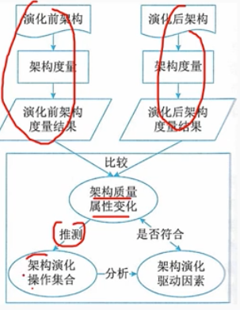

 # 10.6 软件架构的演化和维护-大型网站系统架构演化实例

## 1. 第一阶段：单体架构

        小型网站最开始没有太多人访问，只需要一台服务器就绰绰有余这时网站的应用程序、数据库、文件等所有资源都在一台服务器.

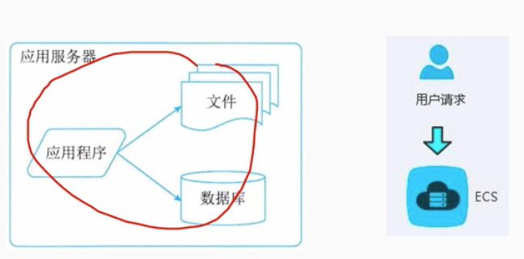

## 2. 第二阶段：垂直架构

        应用服务器将应用和数据分离，整个网站使用 3 台服务器的:应用服务器、文件服务器和数据库服务器
        - 应用服务器处理大量的业务逻辑，因此需要更快更强大的处理器速度。
        - 数据库服务器需要快速磁盘检索和数据缓存，因此需要更快的磁盘和更大的内存。
        - 文件服务器需要存储大量用户上传的文件，因此需要更大容量的硬盘

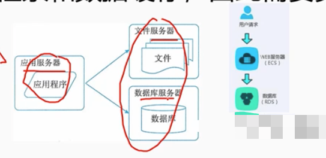

## 3. 第三阶段：使用缓存改善网站性能。

        把经常访问的小部分数据缓存在内存中，可以减少数据库的访问压力，提高整个网站的数据访问速度，改善数据库的写入性能。
        网站使用的缓存可分为两种：
        - 缓存在应用服务器上的本地缓存
        - 缓存在专门的分布式缓存服务器上的远程缓存
        使用缓存后，数据访问压力得到有效缓解，但是单一应用服务器能够处理的请求连接有限，在网站访问高峰期，应用服务器成为整个网站的瓶颈

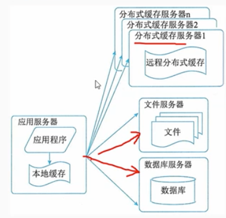

## 4. 第四阶段：使用服务器集群改善网站并发处理能力

        通过增加服务器的方式改善负载压力、提高系统性能，从而实现系统的可伸缩性。应用服务器集群是网站可伸缩架构设计中较为药单成熟的一种

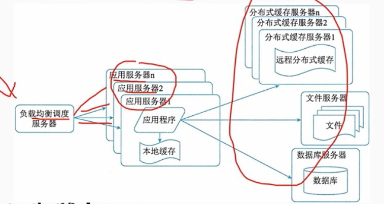
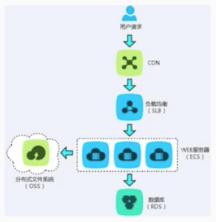

## 5. 第五阶段：数据库读写分离

        在网站的用户达到一定规模后，数据库因为负载压力过高而成为网站的瓶颈。目前的主流数据库提供主从热备功能，通过配置两台数据库主从关系，可以将一台数据库服务器的数据更新同步另一台服务器上。网站利用数据库的这一功能，实现数据库读写分离，从而改善数据库负载压力。
        应用服务器在写数据的时候，访问主数据库，主数据库通过主从复制(同步)机制将数据更新同步到从数据库，这样当应用服务器读数据的时候，就可以通过从数据库获得数据.

## 6. 第六阶段：使用反向代理和CDN加速网站响应

        随着网站业务不断发展，用户规模越来越大，由于区域的差别使得网终环境异常复杂，不同地区的用户访问网站时，速度差别也极大。为了更好的用户体验，网站需要加速网站访问速度。主要手段有使用CDN和反向代理。CDN和反向代理的基本原理都是缓存
        - CDN部署在网终提供商的机房，使用户在请求网站服务时，可以从距离自己最近的网络提供商机房获取数据
        - 反向代理部署在网站的中心机房，当用户请求到达中心机房后首先访问的服务器是反向代理服务器，如果反向代理服务器中缓存着用户请求的资源，就将其直接返回给用户。

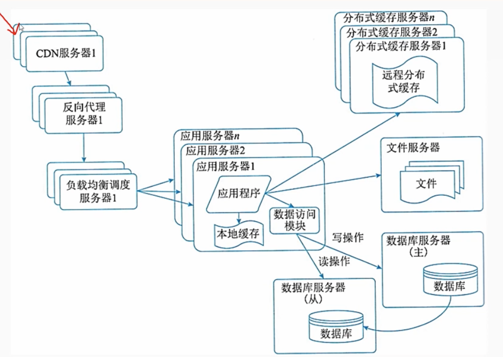

## 7. 第七阶段：使用分布式文件系统和分布式数据库系统

        任何强大的单一服务器都满足不了大型网站持续增长的业务需求.数据库经过读写分离后，一台服务器拆分成两台服务器，但是随着网站业务的发展依然不能满足需求，这时需要使用分布式数据库。文件系统也一样，需要使用分布式文件系统。分布式数据库是网站数据库拆分最后手段，只有在单表数据规模非常庞大的时候才使用。不到不得已时，网站更常用的数据库拆分手段是业务分库，将不同业务的数据部署在不同的物理服务器上.

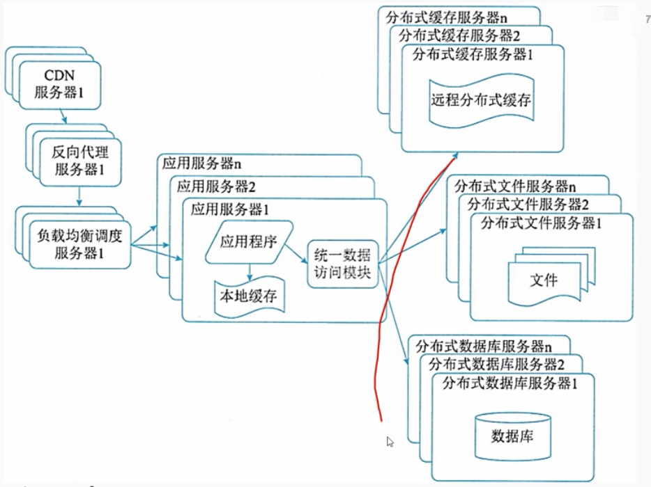

## 8. 第八阶段：使用Nosql和搜索引擎

        随着网站业务越来越复杂，对数据存储和检索的需求也越来越复杂，网站需要采用一些非关系数据库技术，如 NoSQL和非数据库查询技术如搜索引擎。NoSQL 和搜索引警都是源自互联网的技术手段，对可伸缩的分布式特性具有更好的支持。应用服务器则通过一个统一数据访问模块访问各种数据，减轻应用程序管理诸多数据源的麻烦。

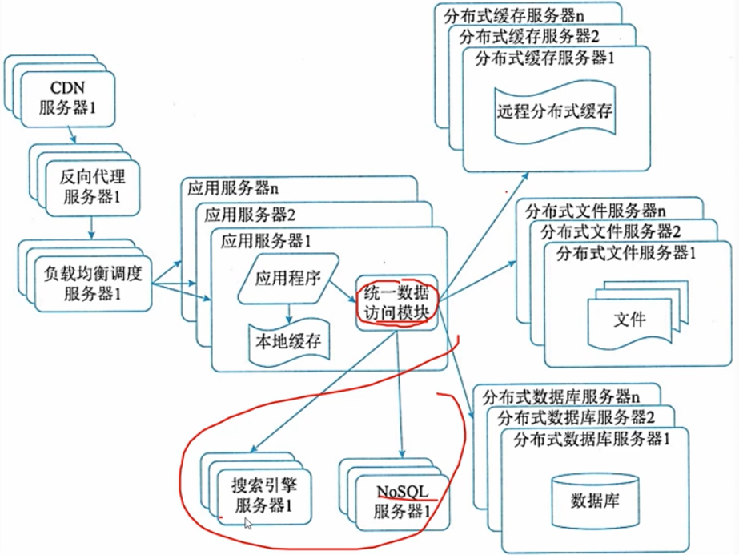

## 9. 第九阶段：业务拆分

        大型网站为了应对日益复杂的业务场景，通过使用分而治之的手段将整个网站业务分成不同的产品线。如电商网站都会将首页.商铺、订单、买家、卖家等拆分成不同的产品线，分归不同的业务团队负责。具体到技术上，也会根据产品线划分，将一个网站拆分成许多不同的应用，每个应用独立部署。应用之间可以通过一个超链接建立关系，也可以通过消息队列进行数据分发，当然最多的还是通过访问同一个数据存储系统来构成一个完整系统

## 10. 第十阶段：分布式服务
        
        随着业务拆分越来越小，存储系统越来越庞大，应用系统的整体复杂度呈指数级增加，部署维护越来越困难。由于所有应用要和所有数据库系统连接，在数万台服务器规模的网站中，这些连接的数目是服务器规模的平方，导致数据库连接资源不足，拒绝服务。既然每一个应用系统都需要执行许多相同的业务操作，比如用户管理、商品管理等，那么可以将这些共用的业务提取出来独立部署。由这些可复用的业务连接数据库，提供共用业务服务而应用系统只需要管理用户界面，通过分布式服务调用共用业务服务完成具体业务操作.

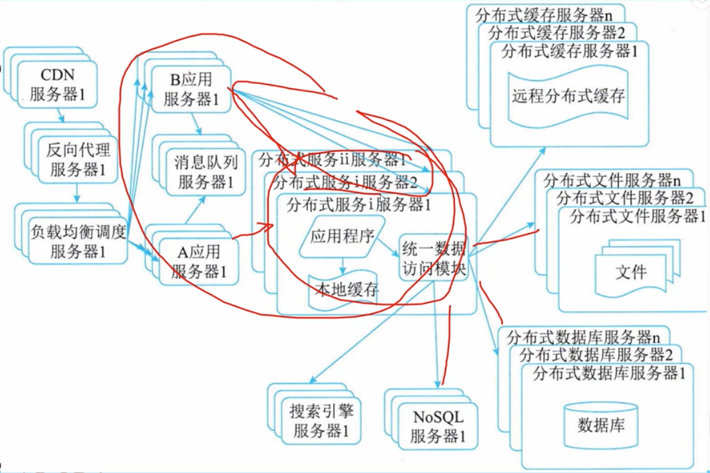

# 10.7 软件架构的演化和维护-架构维护

        软件架构是软件开发和维护过程中的一个重点制品，是软件需求和设计、实现之间的桥梁。软件架构的维护与演化密不可分，维护需要对软件架构的演化过程进行追踪和控制，以保障软件架构的演化过程能够满足需求(亦有说法将架构维护作为架构演化的一部分)。
        由于软件架构维护过程--“般涉及架构知识管理、架构修改管理和架构版本管理等内容，下面分别对它们进行介绍。

## 1. 软件架构知识管理

        软件架构知识管理是对架构设计中所隐含的决策来源进行文档化表示，进而在架构维护过程中帮助维护人员对架构的修改进行完善的考虑，并能够为其他软件架构的相关活动提供参考。
        
        1.架构知识的定义
        架构知识= 架构设计+架构设计决策

        2.架构知识管理的含义
        架构知识管理侧重于软件开发和实现过程所涉及的架构静态演化从架构文档等信息来源中捕捉架构知识，进而提供架构的质量属性及其设计依据以进行记录和评价。

## 2. 软件架构修改管理

        在软件架构修改管理中，一个主要的做法就是建立一个隔离区域保障该区域中任何修改对其他部分的影响比较小，甚至没有影响为此，需要明确修改规则、修改类型，以及可能的影响范围和副作用等。

## 3. 软件架构版本管理

        软件架构版本管理为软件架构演化的版本演化控制、使用和评价等提供了可靠的依据，并为架构演化量化度量奠定了基础

## 4. 软件架构可维护性度量实践

        架构可维护性的六个子度量指标:
        1.圈复杂度(CCN)
        2.扇入扇出度(FFC)
        3.模块间耦合度(CBO)
        4.模块的响应(RFC)
        5.紧内聚度TCC
        6.松内聚度LCC

### 4.1 圈复杂度(CCN)

        由于在组件图中组件是独立的，每个组件代表一个系统或子系统中的封装单位，封装了完整的事务处理行为，组件图能够通过组件之间的控制依赖关系来体现整个系统的组成结构。
        对架构的组件图进行圈复杂度的度量，可以对整个系统的复杂程度做出初步评估，在设计早期发现问题和做出调整,并预测待评估系统的测试复杂度，及早规避风险，提高软件质量。
        实践表明程序规模以 CCN<=10为宜

### 4.2 扇入扇出度(FFC)

        扇入是指直接调用该模块的上级模块的个数，扇出指该模块直接调用的下级模块的个数。
        用扇入扇出度综合评估组件主动调用以及被调用的频率。
        扇入康出度越大，表明该组件与其他组件间的接口关联或依赖关联越多

### 4.3 模块间羯合度(CBO)

        模块间耦合度CBO度量模块与其他模块交互的频繁程度组件与其他组件的依赖关系及接口越多，该组件的耦合度越大CBO 越大的模块，越容易受到其他模块修改和错误的影响，因而可维护性越差，风险越高。

### 4.4 模块的响应(RFC)
        
        RFC度量组件执行所需的功能的数量，包括接口提供的功能、依赖的其他模块提供的功能以及子模块提供的功能.

## 4.5 模块间内聚度--紧内聚度TCC和松内聚度LCC

        内聚度是模块内部各成份之间的联系紧密程度，联系越紧其内聚度越大。好的架构设计应该遵循"高内聚低耦合"原则，提高模块的独立性，降低模块间接口调用的复杂性

