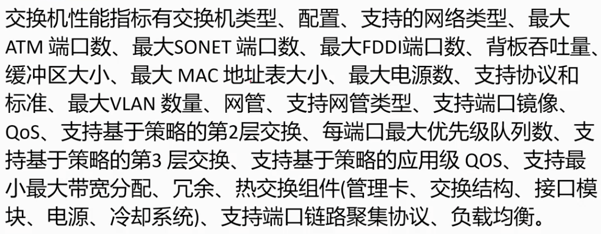

# 2.9 计算机系统基础知识-系统性能

## 1. 系统性能
    是系统提供给用户的所有性能指标的集合。
    系统性能包括性能指标、性能计算、性能设计、性能评估四个方面。

### 1.1 系统性能的指标

- 时钟频率
- 运算速度
- 运算精度
- 内存的存储容量
- 存储器的存取周期
- 数据处理速率PDR
- 吞吐率
- 各种响应时间
- 各种利用率
- RASIS 特性：可靠性（Reliability）、可用性（Availability）、可维护性（Serviceability）、完整性（Integrity）、安全性（Security）
- 平均故障响应时间
- 兼容性
- 可扩展性
- 性价比


### 1.2 路由器的性能指标


### 1.3 交换机的性能指标



### 1.4 网络的性能指标
    设备级性能指标、网络级性能指标、应用级性能指标、用户级性能指标和吞吐量

### 1.5 操作系统的性能指标
    操作系统的性能指标有系统上下文切换、系统响应时间、系统的吞吐率、系统资源利用率、可靠性、可移植性。

### 1.6 数据库管理系统的性能指标


### 1.7 WEB服务器的性能指标

    最大并发连接数、响应延迟、吞吐量。

## 2 性能指标的计算
    性能指标的计算方法：
- 定义法：根据定义直接获取器理想数据
- 公式法：根据定义所衍生的负荷性能指标的计算
- 程序检测法：通过程序进行实际的测试来得到其实际值
- 仪器检测法：通过硬件一起进行测量得到其实际值。

### 2.1 常见指标计算方法：

- MIPS 计算方法
```text
MIPS 即每秒处理的百万条指令数
MIPS = 指令条数/（执行时间*10^6）=Fz/CPI=IPC*Fz

Fz 为处理器的工作主频
CPI 为每条指令的平均时钟周期数
IPC 为每个时钟周期内执行的指令条数
```


- 峰值计算
```text
衡量计算机系统性能的一个重要指标是系统的峰值性能，即系统在某种条件下的最大性能。
理论峰值是该计算机理论上每秒钟能完成浮点计算最大次数，它主要是由cpu的主频决定。
理论浮点峰值 = cpu主频 * cpu每个始终周期浮点计算次数 * cpu数量
```

- 等效指令速读法
```text
也称Gibson(吉普森）法，通过统计各类指令在程序中所占比例进行折算。

T=W1*T1+W2*T2+W3*T3+...+Wn*Tn (n为指令种类数，Wi为第i类指令所占比例，Ti为第i类指令的执行时间)
```

## 3. 性能设计

### 3.1 性能调整
    为了优化系统性能，需要对系统进行性能调整：
    收集状态、分析问题、配置系统、测试。通过折个步骤反复标间，优化系统性能指标。

### 3.2 阿姆达尔解决方案
    阿姆达尔定律定义了采用特定部件所取得的加速比。
    加速比=不使用增强部件时完成整个任务的时间/使用增强部件时完整整个任务的时间。


## 4. 性能评估
 
    性能评估是为了一个目的，按照一定的步骤，选用一定的度量项目，通过建模和实验，对系统的性能进行各项检测，测试结果做出解释。
    位性能的优化提供参考。

### 4.1 基准测试程序

    易考程序来评价机器的性能。
    
    准确度依次递减：
    真实的程序>核心程序>小型基准程序>合成基准程序。
    
    把应用程序中用得最多、最频繁的那部分核心程序作为评价计算机性能的标准程序，成为基准测试程序。
    
    有：整数基准测试程序，浮点测试程序，whetstone基准测试程序，spec基准测试，tpc基准测试

### 4.2 Web服务器的性能评估

    在Web服务器测试中，反应性能的主要指标有：
    - 最大并发连接数
    - 响应延迟
    - 吞吐量等
    
    常见Web服务器性能评测方法：
    - 基准性能测试
    - 压力测试
    - 可靠性测试

### 4.3 系统监视

    系统监视方法：

- 通过系统本身提供的命令：w,ps,last,netstat等命令进行
- 通过系统记录的文件日志
- 集成命令、文件记录和可视化技术。如：win的perfmon应用程序。