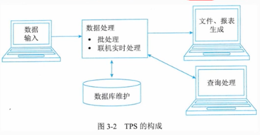
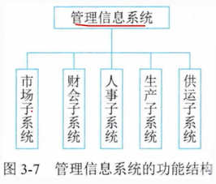
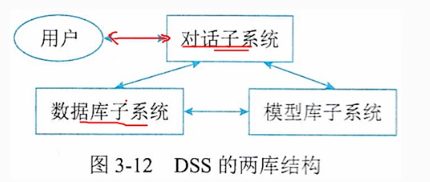

# 3. 信息系统基础知识

## 1 信息系统概述

### 1.1 信息系统的定义
    信息系统是由计算机硬件、网络、通信设备、计算机软件、信息资源、信息用户和规章制度组成的以处理信息流为目的的人机一体化系统。
    信息系统任务是对袁术数据进行收集、加工、存储，并处理产生各种所需的信息，以不同的方式提供给各类用户使用。
    5个基本功能：输入、存储、处理、输出、和控制。

### 1.2 信息系统的分类

- 业务处理系统 TPS （Transaction Processing System）
- 管理信息系统 MIS （Management Information System）
- 决策支持系统 DSS （Decision Support System）
- 专家系统 ES （Expert System）
- 办公自动化系统 OAS （Office Automation System）
- 综合性信息系统 EIS （Executive Information System）

### 1.3 信息系统的生命周期

    分为4个阶段：
- 产生阶段：概念产生、需求分析、可行性研究
- 开发阶段：系统设计、系统实现、系统测试
- 运行阶段：系统投入运行、系统运行维护
- 消亡阶段：系统报废、系统升级

#### 1.3.1 信息系统的产生阶段
- 概念的产生过程：根据企业经营管理需要，提出建立信息系统的设想。
- 需求分析过程：对企业的业务流程、业务规则、业务数据、业务环境进行分析，确定信息系统的功能需求。

#### 1.3.2 信息系统的开发阶段
- 总体规划
```text
总体规划包括信息系统的开发目标、信息系统的总体架构、信息系统的组织结构和管理流程、实施计划、技术规范等。
```
- 系统分析
```text
对后续的设计阶段逻辑模型。
梳理企业业务流程，建立企业业务模型。系统分析包括组织结构及功能分析、业务流程分析、数据和数据流程飞、系统初步方案等
```
- 系统设计
```text
系统设计是在系统分析的基础上，对系统进行详细设计，包括系统的物理模型、系统的软件设计、系统的硬件设计、系统的网络设计、系统的安全设计、系统的人机界面设计、系统的数据库设计、系统的测试计划等
```
- 系统实施
```text
系统实施是指将系统设计方案转化为实际运行的系统的过程，包括系统的编码、系统的测试、系统的安装、系统的培训、系统的转换等
```
- 系统验收
```text
系统验收是指对系统实施的过程进行检查，进行验收
```

#### 1.3.3 信息系统的运行阶段
    维护分为4种类型：
- 改正性维护（排错性维护）：对系统中出现的错误进行改正
- 适应性维护：适应信息技术环境的变化而进行的维护。
- 完善性维护：对系统的功能进行扩充，以满足用户的新需求。
- 预防性维护：改进应用软件的可靠性和可维护性，主动增加新的工鞥，使系统适应各类变化而不被淘汰。

#### 1.3.4 系统消亡阶段
    企业信息系统经常遇到系统更改改造功能扩展甚至报废重建的情况。

### 1.4 信息系统的开发方法
- 结构化方法
- 面向对象方法
- 原型法
- 面相服务方法

### 2 业务处理系统(TPS)

### 2.1 业务处理系统的定义
    业务处理系统是指为企业的日常业务活动提供信息支持的系统，是企业信息系统的基础，是企业信息系统的核心部分。
    针对管理中具体的事务，例如：财会、销售、采购、库存、人事、生产等，对企业的日常业务活动进行信息化处理。
    是服务于组织挂号里层次中最底层、最基本的信息系统。

### 2.2 业务处理系统的功能
    针对日常事务数据进行输入、处理、输出、存储、控制等功能，以支持企业的日常业务活动。

 

## 3 管理信息系统(MIS)

### 3.1 管理信息系统的概念
    管理信息系统是由业务系统发展而成，在TPS基础上引进大量管理方法对企业整体信息进行处理，并利用嘻嘻进行预测、控制、计划、帮助企业全面管理的信息系统。
    由四大部件组成：信息资源、信息处理器、信息用户、信息管理者。


### 3.2 管理信息系统的功能
    管理信息系统从使用者的角度看，它总是有一个目标，具有多种功能，构成一个机油结合的整体，组成一个功能结构。



## 4 决策支持系统(DSS)

### 4.1 决策支持系统的概念
    决策支持系统是一个有语言系统、知识系统和问题处理系统组成的系统三个互相关联的部分组成的，基于计算机的系统。
    DSS应具有的特征是：
- 数据和模型是DSS的主要资源
- DSS是用来支援用户决策而不是代替用户决策
- DSS是主要用于解决半结构化及非结构化问题
- DSS的作用在于提高决策质的有效性而不是提高决策的效率

### 4.2 决策支持系统的结构
    DSS的结构包括三个部分：数据库、模型库、对话 三个子系统组成。


## 5、专家系统(ES)

### 5.1 专家系统的概念
    专家系统是一种智能计算机程序系统，其内部含有大量的某个领域专家水平的知识与经验，引用人人工智能和计算机系统，能够模拟人类专家的思维方式和解决问题的能力，为用户提供专家水平的决策支持

### 5.2 人工智能
       人工智能是计算机科学的一个分支，它企图了解智能的实质，并生产出一种新的能与人类只能相似的方式做出反应的只能机器，该领域的研究包括机器人、语言识别、图像识别、自然语言处理和专家系统等。

### 5.3 专家系统的组成
    专家系统的应用领域不同，求解问题的类型不同，专家系统的组成也不同，但是专家系统的基本组成是相同的。
    主要包括知识库、推理机、综合数据库。


#### 5.3.1 知识库
    存放求解问题的领域知识。知识库中知识可分成两类：
- 事实知识：又叫事实，是指学习者通宵一门学科或解决其中的问题所必须知道的基本要素。
- 启发性知识：指与问题有关且能够加快推理过程，求解问题最优解的知识。
    知识库中的知识的质量决定只专家系统的质量水平。

#### 5.3.2 综合数据库
    综合数据库是在执行与推理过程中用来存放所需要和产生的各种信息的工作存储器，通常包括就觉问题的初始数据、推理过程中产生的中间数据和最终的结论数据。
    又叫动态知识库，内容在系统运行过程中是不断变化的。
    对应的把专家系统知识库又叫静态知识库。


#### 5.3.3 推理机
    又称控制结构或规则解释器。推理机和知识库一起构成专家系统的核心。
    推理机通常包括推理机制和控制策略，是一组用来控制系统的运行、执行各种任务、根据知识库进行搜索和推理的程序模块。
    推理机制：是指推理机的推理过程，是推理机的核心部分。
- 正向推理/前向推理：从已知事实出发，根据规则进行推理，得到结论。
- 反向推理/逆向推理：从目标出发，根据规则进行推理，得到结论。
- 双向队里/混向推理：正向推理和逆向推理相结合的推理方式。

## 6 办公自动化系统

### 6.1 办公自动化系统概念
    办公自动化系统是一先进的科学技术为基础，利用有关办公自动化设备协助办公人员管理各项办公信息，主要利用资源以提高办公效率和办公质量。

### 6.2 办公自动化系统的功能

- 事务处理
    单机系统，包括文字处理、日程安排、文档管理、单子报表、数据处理
    多级系统，包括：电子会议、电子邮件，语音处理、图形图像处理，联机情报检索等。
- 信息管理
    信息流的控制管理，包括信息的收集、加工、传递、存储、检索、分析、判断、应用和反馈。
- 辅助决策
    预定目标并做出行动决定。

### 6.3 办公自动化系统的组成
- 计算机设备
- 办公设备
- 数据通信及网络设备
- 软件系统

## 7 企业资源计划系统(ERP)

### 企业资源计划系统的概念
    企业资源计划系统建立在信息技术基础上，利用现代企业的先进管理思想，全面地集成了企业的所有资源信息，并未企业提供决策支持的信息系统。
    ERP将管理的重心转移到财务上，针对物资资源管理、财务资源管理、信息资源管理集成一体化的企业管理软件。

## 8  典型信息系统架构模型

### 8.1 电子政务的概念
    电子政务是指政府部门利用现代信息技术，对政府福安里和服务职能进行集成，在网络上实现政府组织结构和工作流程优化重组，超越时间、空间与部门分割的制约。
    实现公务、政务、商务、事务的一体化管理与运行。

### 8.2 电子政务的模型有
    G2G：政府与政府之间的电子政务
    G2B：政府与企业之间的电子政务
    G2C：政府与公民之间的电子政务
    G2E：政府与员工之间的电子政务

### 8.3 电子商务模型有
    B2B：企业与企业之间的电子商务
    B2C：企业与消费者之间的电子商务
    C2C：消费者与消费者之间的电子商务
    O2O：线上与线下之间的电子商务
