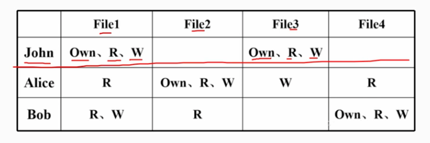
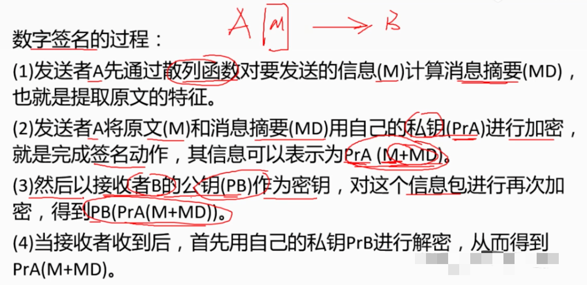
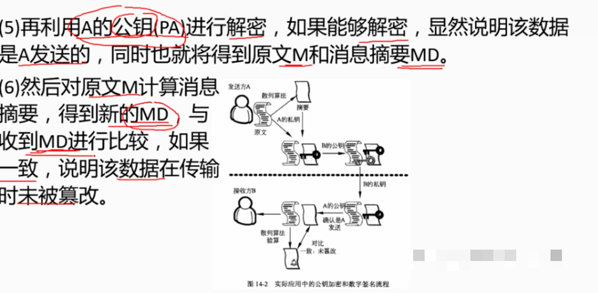
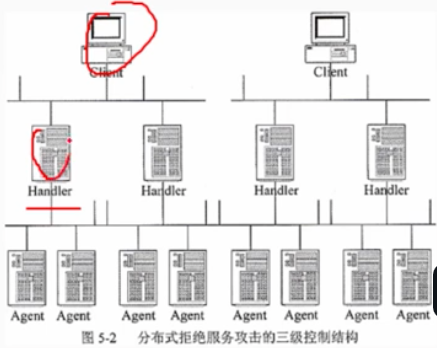
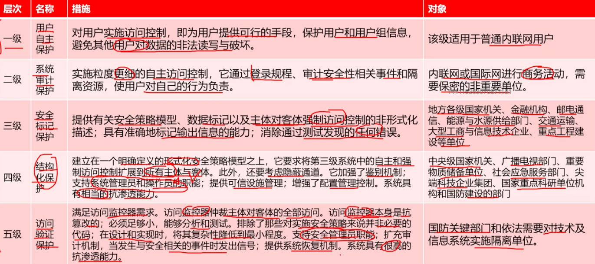
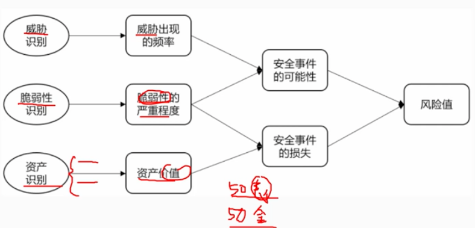
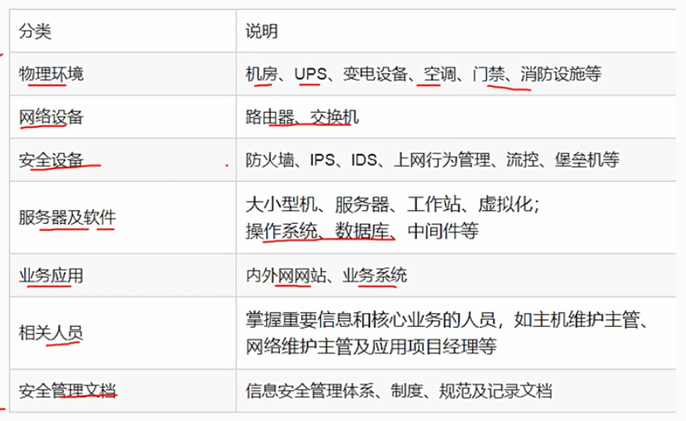
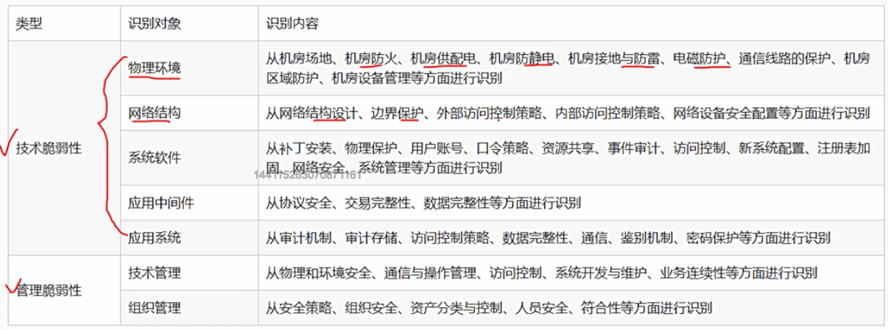

# 4 信息安全技术基础知识

# 一 信息安全技术的概念
    信息安全包括5个基本要素：
    信息安全的目标是保证信息的机密性、完整性、可用性、可控性和可审查性。
- 机密性：信息不暴露给未授权的个人、实体或过程所访问。
- 完整性：只能得到允许的人才能修改数据，并且能够判别出数据是否被篡改。
- 可用性：授权用户在需要时能够访问信息和资源。
- 可控性：可以控制授权范围内的信息流向及行为方式。
- 可审查性：对出现的信息安全问题提供调查的依据和手段。

## 1 信息安全的范围
    信息安全的范围包括：
    设备安全

### 1.1 设备安全
    信息系统设备的安全是信息系统安全首要问题，包括：
- 设备的稳定性：设备在一定时间内不出现故障的概率。
- 设备的可靠性：设备在一定时间内正常执行任务的概率。
- 设备的可用性：指设备可以正常使用的概率。
        
### 1.2 数据安全
    数据安全是采取措施确保免受未授权的泄露、篡改和毁坏。
       数据安全包括：
    数据的秘密性：数据不被未授权的个人、实体或过程所访问。
    数据的完整性：数据是正确的、真实的、未被篡改的、完整无缺的属性。
    数据的可用性：可以随时正常使用的属性。

### 1.3 内容安全
    内容安全是信息安全在政治、法律、道德层次上的要求，包括：
    政治上是健康的
    符合国家的法律法规
    符合中华民族优良的道德规范

### 1.4 行为安全
    信息系统的服务功能最终通过行为提供给用户，却不熬信息系统的行为安全，才能最终确保系统的信息安全。
    行为的秘密性：过程和结果不能危害数据的秘密性
    行为的完整性：行为的过程和结果是预期的。
    行为的可控性：当行为过程偏离预期时，能够发现、控制和纠正。

## 2 信息存储安全
    信息的存储安全包括信息使用的安全、系统安全监控、计算机病毒防治、数据的加密和防治非法的攻击等。

### 2.1 信息使用的安全
    
（1）用户的标识和验证：
- 基于用户所拥有特殊安全物品的识别：USBKey、智能卡、生物特征等。 
- 基于人的物理特征的识别：指纹、虹膜、面部、声音等。

（2）用户存取权限的限制
    用户进入系统所能做的操作
- 隔离控制法。物理隔离（设备不联网）、时间隔离、逻辑隔离、密码技术隔离
- 限制权限法。不同的用户分配不同的操作权限

### 2.2 系统的安全监控
    建立一套完整的安全监控系统，全面监控系统的活动，及时发现异常，及时采取措施，防止损失扩大。
    利用日志和审计功能对系统进行安全监控。

### 2.3 计算机病毒防治
    计算机病毒具有隐蔽性、传染性、破坏性、自我复制性、潜伏性、变异性等特点。
    计算机病毒防治的方法：
- 经常从软件供应商店网站下载和升级杀毒软件。
- 定期检查敏感文件是否被病毒感染。
- 使用高强度的密码。
- 经常备份数据
- 选择经过公安部认真的防病毒软件，定期检测和清理。
- 在计算机和因特网之间使用防火墙。
- 不使用是断开网络
- 重要计算机系统和网络严格与物理网络隔离
- 不打开陌生人发来的电子邮件
- 正确配置系统和病毒防治软件

## 3 网络安全
（1）网络安全的威胁
主要在以下5个方面：
- 非授权访问。主要是：假冒、身份攻击、非法用户进入网络系统进行违法操作、合法用户以未授权方式进行操作等。
- 信息泄露和丢失。通常包括信息在传输中丢失和泄露、信息在存储介质中丢失或泄露以及通过建立隐蔽隧道等方式窃取敏感信息等
- 破坏数据完整性。对数据进行篡改、破坏、删除等。
- 拒绝服务。通过攻击网络系统，使网络系统不能正常提供服务。
- 利用网络传播计算机病毒。通过网络传播计算机病毒，破坏网络系统。

（2）安全措施
- 认证：确认用户的身份
- 访问控制：限制用户的访问权限
- 完整性：防止数据被篡改
- 审计：记录用户的操作
- 保密：确保敏感数据不被泄露

# 二、信息系统安全的作用和意义

    2014年中央成立了信息化领导小组，习近平主席担任中央网络安全与信息化领导小组组长。指出：没有网络安全就没有国家安全，没有信息化就没有现代化。

# 三、信息安全系统的组成框架

## 1. 技术体系
    从实现技术来看，信息安全系统涉及基础安全设备、计算机网络、操作系统安全、数据库安全、终端设备安全等多方面技术。

（1）基础安全设备
    包括芯片、加密卡、身份识别卡等，还涵盖物理环境保障技术、建筑物、机房条件及硬件设备条件满足信息系统的机械防护安全。
    通过电力供应设备以及信息系统组件的抗电磁干扰和电磁泄露性能的选择性措施达到相应的安全目的。
（2）计算机网络安全
    网络传输过程中的安全防范，用于防治和监控未经授权破坏、更改和盗取数据的行为。
    涉及物理隔离、防火墙及访问控制，加密传输、认证、数字签名、摘要、隧道及vpn技术，病毒防范及上网行为管理，安全审计等实现技术。
（3）操作系统安全
    无错误配置、无漏洞、无后门、无特洛伊木马等，防止未经授权的访问、防止病毒、防止非法的操作等。
    操作系统的安群机制：标识与鉴别机制、访问控制机制、最小特权管理、可信通路机制、运行保障机制、存储保护机制、文件保护机制、安全审计机制等。 
（4）数据库安全
    分为数据库系统和数据库应用系统安全。
    涉及数据库的完整性、逻辑数据库的完整性、元素安全性、可审计性、访问控制、身份认证、可用性、推理控制、多级保护、消除隐藏通道等。
（5）终端设备安全
    电信网络终端设备的角度分为电话密码机、传真密码机、异步数据密码机等。

## 2 组织机构体系
    是组织保障系统:机构、岗位、人事机构三个模块构成一个体系。
    机构的设置分为3个层次:决策层、管理层、执行层
    岗位是信息系统安全管理机关设定的负责某一个或某几个安全事务的职位。
    人事机构是根据管理机构设定的岗位，对岗位上在职、待职和离职的雇员进行素质教育、业绩考核和安全监管的机构。

## 3. 管理体系
    法律管理、制度管理、培训管理3个组成部分。
（1）法律管理是根据相关的国家法律、法规对信息系统主体及其与外界关联行为的规范和约束。
（2）制度管理是依据国家、团体的安全需求制定的一系列内部规章制度。
（3）培训管理是确保信息系统安全的前提

# 四、信息加解密技术

## 1. 数据加密

    数据加密是利用数学物理手段，对电子信息进行转换，使其在一定条件下，只能被特定的人或特定的设备所识别，从而达到保密的目的。


## 2. 对称秘钥技术
    对称秘钥技术是指加密和解密使用同一个秘钥的技术。
    优点：加密和解密速度快，适合于大数据量的加密和解密。
    缺点：秘钥的管理和分发比较困难，安全性差。
    适用场景：对称秘钥技术适用于对数据进行加密和解密的场景，如对文件、磁盘、数据库等进行加密和解密。
    常见对称秘钥技术：
- DES：数据加密标准，是一种对称秘钥技术，使用56位秘钥对数据进行加密。
- 3DES：三重DES，是对DES的改进，使用112位秘钥对数据进行加密。
- IDEA：秘钥长度为128位，明文和密文都是64位。
- AES/SM4(中国商用加密算法)/RC2/RC4/RC5

## 3. 非对称秘钥技术（公钥算法）
    非对称秘钥技术是指加密和解密使用不同秘钥的技术。 私钥（自己保存）+公钥（分发）
    优点：秘钥的管理和分发比较容易，安全性好。
    缺点：加密和解密速度慢，适合于小数据量的加密和解密。
    适用场景：非对称秘钥技术适用于数字签名、数字证书、密钥交换等场景。
- RSA: 理论基础是数论中大素数分解的困难性。1

# 五、秘钥管理技术

## 1. 对称秘钥的分配与管理
    秘钥的分配一般要解决两个问题
（1）一是引进自动分配秘钥机制，以提高系统的效率
（2）极可能减少系统中的秘钥量。

### 1.1 对称密钥的分配
    两个用户A和B在获得共享秘钥时有4种方式：
- 经过A选取的秘钥tongue哦物理手段发送给另一方B
- 由第三方选择秘钥，物理手段分别发送给A和B
- A/B事先有一个秘钥，其中乙方选择新秘钥后，用已有秘钥加密改新秘钥后发送给另一方。
- 三方A/B/C各有一个保密信道，C选秘钥后，分别通过A/B的保密信道发送给A/B。

## 2 非对称秘钥（公钥）公钥加密的秘钥管理

### 2.1 公钥分发
    用户将自己的公钥发送给每一位其他用户，方法简单。缺点是任何人都可以伪造秘钥公开发布。
    如伪装成A,以A的名义向另一用户发送自己的公钥，则在A发现假冒者前，假冒者可解读所有发向A的加密信息。甚至还能用伪造的秘钥获得认证。

### 2.2 公钥目录表
    公用目录表是指一个公用的公钥动态目录表，其中包含了所有用户的公钥。用户可以从公用目录表中查找到其他用户的公钥。由可信的第三方维护公用目录表，用户可以向第三方查询公钥。
    管理员将用户的公钥加入到公用目录表中，用户可以从公用目录表中查找到其他用户的公钥。
    优点：用户可以从公用目录表中查找到其他用户的公钥，方便用户使用。
    缺点：公用目录表的安全性要求很高，否则会导致公钥泄露，从而导致信息泄露。

### 2.3 公钥管理机构
    用户B将自己的公钥加密后传输给公钥管理机构。
    当A获取B的公钥时，向管理机构发送请求，管理机构用自己的私钥加密B的公钥后发送给A，A收到后用管理机构的公钥解密，得到B的公钥。
    缺点：机构容易成为攻击者的目标，一旦机构的私钥泄露，所有用户的公钥都会泄露。


### 2.4 公钥证书
    公钥证书时郑虎管理机构（CA）为用户建立的，其中的数据项有雨该用的私钥相匹配的公钥及用户的身份和时间戳等，所有的数据项由CA用自己的私钥加密后形成的文件。
    CA的私钥加密（时间戳T + 用户签名ID(用户的私钥加密的ID) + 用户公钥）= 公钥证书（CA证书），由CA的私钥加密后形成的文件。
    这样证书交换用户间的公钥而无需在于公钥管理机构进行交互，避免了公钥管理机构的私钥泄露。

# 六、访问控制及数字签名技术

## 1. 访问控制技术
    访问控制是主题依据某些控制策略或权限对客体本身或是其资源进行的不同授权的访问。

（1）访问控制的基本模型
- 主体（Subject）：可对其他实体施加动作的主动实体。简称S。可以是用户本身、组织、计算机终端、进程、程序、文件等。
- 客体（Object）：可被其他实体施加动作的被动实体。简称O。可以是文件、数据库、系统、网络、资源、信息等。
- 控住策略：主体对客体操作行为集和约束。简称KS。可以是访问规则集，访问策略是一种授权行为。
    访问控制包括认证、控制策略、审计三个部分。

（2）访问控制的实体技术
- 访问控制矩阵
```text
    主体为行索引，客体为列索引的矩阵。
    例：主体John 对客体File1 的访问控制矩阵：拥有、读、写
```

- 访问控制列表
```text
每个客体有一个访问控制表，按列保存访问矩阵。但是访问控制表查询一个主题对多有课题的访问权限很困难。
```

- 能力表
```text

```

- 授权关系表
```text
    每一行表示主体和客体的授权关系。
```


## 2. 数字签名技术
    数字签名通过一个单项函数对要传送的报文进行处理，得到用以认证报文来源并核实报文是否发生变化的一个字母数字串。
（1）数字签名可以解决否认、伪造、篡改和冒充的问题。（数据的完整性和不可抵赖性）
（2）数字签名使用的是公钥算法（非对称秘钥）

### 2.1 数字签名过程




### 2.2 数字加密和数字签名的区别

（1）数字加密是用接受者的公钥加密，接受者用自己的私钥解密。

（2）数字签名是：将 Md5（Hash散列函数） 摘要用发送者的私钥加密，接受者用发送者的公钥解密，得到摘要， 然后用 Md5（Hash散列函数） 算法对原文进行摘要，将两个摘要进行比较，如果相同，则说明原文没有被篡改。

### 2.3 数字签名的条件
    可用的数字签名应保证以下条件：
- 签名是可信的
- 签名是不可伪造的
- 签名是不可重用
- 签名的文件是不可改变的
- 签名的文件是不可抵赖的


# 七、 信息安全的抗攻击技术

## 1、秘钥的选择
    秘钥在概念上分为两类：数据加密秘钥DK和秘钥加密秘钥KK
    前者直接怼数据进行加密，后者用于保护秘钥。
    秘钥的生成徐亚考虑3个方面的隐私：
- 增大秘钥空间
- 选择强秘钥
- 秘钥的随机性


## 2. 拒绝服务攻击
    拒绝服务攻击DOS，借助于网络系统或网络协议的缺陷和配置都通进行网络攻击，是网络堵塞，系统资源耗尽，服务无法正常提供的一种攻击方式。
    目前常见的是分布式拒绝服务攻击DDOS，即攻击者通过控制大量的主机对目标主机发起攻击，使目标主机无法正常提供服务。
（1）拒绝服务攻击分类
- 带宽消耗型攻击
```text
    通过向目标主机发送大量的数据包，占用目标主机的带宽资源，使其无法正常提供服务。
    1. 针对网络连接的拒绝服务攻击
    2. 消耗磁盘空间
    3. 消耗CPU资源和内存资源
```
（2）破坏后更改配置信息
```text
    通过修改目标主机的配置信息，使其无法正常提供服务。
    1. 修改DNS服务器的配置信息
    2. 修改路由器的配置信息
    3. 修改防火墙的配置信息
```
（3）物理破坏或改变网络部件
```text
    通过破坏或改变网络部件，使其无法正常提供服务。
    1. 破坏网络设备
    2. 破坏网络线路
    3. 破坏电源设备
```
（4）利用服务程序中的处理错误是服务失效
```text
    发送一些错误的数据包，是程序无法正常执行。
    1. 利用服务程序中的缓冲区溢出
    2. 利用服务程序中的死锁
    3. 利用服务程序中的逻辑错误
```
## 3.分布式拒绝服务攻击DDOS
     分布式拒绝服务攻击首先侵入一些计算机，然后通过这些计算机对目标主机发起攻击，使目标主机无法正常提供服务。
    克服了传统拒绝服务攻击的兽网络资源限制和隐蔽性差量大缺点，危害性更大。
（1）分布式拒绝服务攻击一般采用三级结构：
- Client（客户端）运行在攻击者的主机上，用来发起和控制分布式拒绝服务攻击
- Handler（处理器）运行在被攻击的主机上，用来接收和执行客户端发来的命令
- Agent（代理）运行在被攻击的主机上，用来执行Handler发来的命令,负责对目标实施实际的攻击


  
### 拒绝服务攻击的防御方法
（1）加强对数据包特征识别，通过搜索特征字符串，就可以确定攻击服务器和攻击者的位置。

（2）谁知防火墙监视本地主机端口的使用情况。对本地主机中的敏感端口进行监视。

    例如：UDP 31335,UDP 27444,UDP 27665 ,如果玩不主机主动向网络内部高标口端口发起连接，则防火墙将其列入黑名单，拒绝其访问。


（3）对通信数据量进行攻击也可以获得有关攻击系统的位置和数据信息。

    例如：攻击前，目标网络的域名服务器往往会接受到远超正常数据量的反向和正向的地址查询。

（4）尽可能修正已经 发行的问题和系统漏洞。

## 4. 欺骗攻击与防御

### 4.1 ARP欺骗
    又称ARP毒化或ARP攻击，是针对以太网地址解析协议ARP的一种攻击技术，通过欺骗局域网内访问者PC的网关Mac地址，
    使访问者Pc错以为攻击者更改后的Mac地址是网关的Mac地址，从而将数据包发送给攻击者，导致网络不通。
    此种攻击可让攻击者获取局域网上的数据包甚至可篡改数据包，从而达到窃取信息的目的。


    ARP欺骗的防御方法：
    1. 在WinXP下输入命令 arp -s gate-wap-ip gate-way-mac 固化ARP表，使网关的MAC地址固定不变。
    2. 使用ARP服务器，通过该服务器查找自己的ARP转换表来响应其他机器的ARP广播，确保这台ARP服务器不被黑。
    3. 采用双向绑定的方法解决并且防止ARP欺骗攻击。
    4. 使用arp防护软件 arp guard 

### 4.2 DNS欺骗
    DNS欺骗是指攻击者通过冒充或者修改DNS服务器的缓存，将域名解析到错误的IP地址，使用户访问的网站不是用户想要访问的网站。


    DNS欺骗的检测：被动监听检测、虚假报文检车、交叉查询
    1. 被动监听检测：通过监听DNS服务器的报文，检测是否有DNS欺骗攻击。
        通过旁路监听，捕获所有请求建立映射表。如果一定时间间隔内，存在同一个请求应答多个以上结果是会怀疑是欺骗攻击。
    2. 虚假报文检测：假设攻击者为了快速发出欺骗包，不会对域名服务器IP地址的有效性进行校验。如果像一个非DNS服务器发送假的域名请求，正常来说不会受到任何应答。
        但是由于攻击者不会验证域名对应IP地址的有效性，所以会收到一个虚假的解析出来的IP地址应答包。因此，如果收到了一个虚假的应答包，就可以判断是DNS欺骗攻击。
    3. 交叉检查查询：通过向DNS服务器查询IP地址对应的域名，如果查询到的域名和原来的域名不一致，就可以判断是DNS欺骗攻击。

### 4.3 IP欺骗
    IP欺骗是指攻击者通过伪造IP地址，冒充其他计算机系统，恶意向目标设备发送数据包，从而达到攻击的目的。
    IP欺骗的防御方法：
    使用防火在入口过滤数据包，检查源标头的IP地址与来源是否一致。否则丢弃该数据包。

### 4.4 端口扫描
    端口扫描就是尝试与目标主机的某些端口建立连接，以便确定目标主机上哪些端口处于打开状态，从而得知目标主机上运行着哪些服务。 

### 4.5 强化TCP/IP堆栈以抵御拒绝服务攻击

（1）同步风暴（SYN FLOODING）【半连接】
    
    Syn Flooding攻击中，利用TCP三次握手协议的缺陷。
    攻击者向目标主机发送大量伪造源地址的TCP Syn报文，目标机器响应Syn+Ack后,等待Ack建立连接的过程中，
    但是因为攻击者是伪造的IP，永远无法收到Ack响应，就一直等待中。这是收到大量的请求Syn耗尽系统资源，从而无法响应正常用户的请求。

（2）ICMP 攻击「Internet Control Message Protocol」

    ICMP攻击是指攻击者向目标主机发送大量的ICMP报文，使目标主机的CPU占用率达到100%，从而无法响应正常用户的请求。
    利用系统规定ICMP最大数据包不能超过64KB的缺陷，向主机发送“ping of death”死亡ping 攻击，致使主机出现内存分配错误，从而导致TCP/IP堆栈崩溃，致使主机死机。
    向目标主机长时间、大量发哦是哪个ICMP报文，使目标主机的CPU占用率达到100%，从而无法响应正常用户的请求。

（3）SNMP 攻击 「Simple Network Management Protocol」
    
    SNMP是TCP/IP协议族中的一种应用层协议，它是用来管理网络设备的协议。
    它允许网路中的各种设备和软件，包括交换机、路由器、防火墙、集线器、甚至操作系统、服务器铲平和部件等，能与管理软件同喜。汇报器当前行为和状态
    SNMP还能用于控制这些设备和产品，重定向通信录，改变通信数据包的优先级，甚至重启某些设备。
    入侵者一旦获得了SNMP的访问权限，就可以通过SNMP协议来接管网络设备，从而对网络进行破坏。

### 4.6 系统漏洞扫描

    系统漏洞扫描是对重要计算信息系统进行检查，发现其中可能被黑客利用的漏洞。
    1.基于网络的扫描
    2.基于主机的扫描

（1）基于网络的扫描
    
    通过网络扫描远程主机的漏洞。
    优点：
    - 价格便宜
    - 无需对方目标系统管理员介入
    - 无需目标系统安装软件
    - 维护简单

（2）基于主机的扫描

    通过在目标主机上安装一个代理（agent）或者服务（service）,以便能够访问所有的文件与进程，从而检测出更多的系统漏洞。
    - 扫描的漏洞数量多
    - 集中化管理
    - 网络流量负载小

# 八、计算机信息系统安全保护等级



      

## 安全风险管理

    信息安全风险是各类应用系统在运行过程中，由于系统本身的运行、网络、数据、软硬件、系统集成缺陷或者外部环境的影响，导致的不同程度的安全风险。
    信息安全风险评估是从风险管理的角度，运用科学的手段，系统的分析网络与信息系统锁面临的维系机器存在的脆弱性，评估安全时间一旦发生可能造成的危险程度，
    制定有针对性的抵御危险的防护对策、整改措施，一对大限度的保障网络和信息安全。
 
（1）风险评估的事实流程
- 确定评估范围
- 确定评估目标
- 简历适当的组织结构
- 简历系统的评估方法
- 获得最高管理者对风险评估策略的批准

（2 ）风险评估
    
    风险评估是对信息资产存在的脆弱性，面临的威胁，造成的影响，以及三者综合作用所带来的风险的可能性评估。



- 资产识别



- 脆弱性识别



- 危险计算


