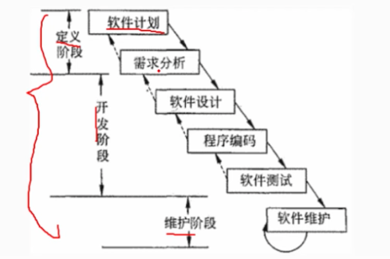
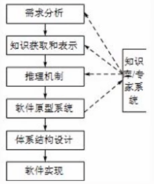
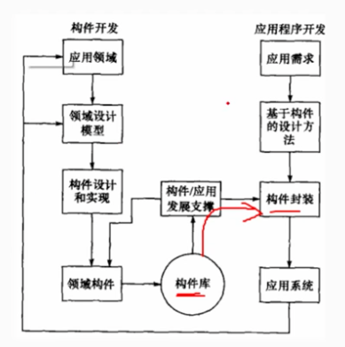
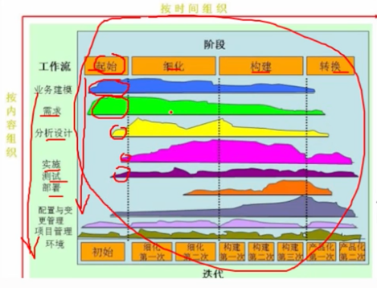

# 5.1 软件工程

> 软件危机：
    软件开发难度难以预测、软件开发成本难以控制、难以满足用户期望、质量无法保证、难以维护、缺少文档资料。
    为了解决软件违建，提出了软件工程的概念。

## 1 软件工程定义
    将系统化的、严格约束的、可量化的方法应用于软件的开发、运行和维护，即将工程化的方法应用于软件开发。
    软件要经历从需求分析、软件设计、软件开发、运行维护，直至被淘汰这样的全过程，这就是软件生命周期。
    为了是软件生命周期中个性任务有序按照规程进行，需要一定的工作模型对各项任务给予规程约束，这样的工作模型称为生命周期模型。

## 2. 软件过程模型

    软件过程模型的基本概念: 
    软件过程是制作软件产品的一组活动以及结果，这些活动主要由软件人员来完成，软件活动主要有如下一些:
    1.软件描述。必须定义软件功能以及使用的限制。
    2.软件开发。也就是软件的设计和实现，软件工程人员制作出能满足描述的软件。
    3.软件有效性验证。软件必须经过严格的验证，以保证能够满足客户的需求
    4.软件进化。软件随着客户的需求不断改进。

## 2.1 瀑布模型

    瀑布模型是一种线性的软件开发过程模型，是最早的软件开发过程模型。

    优点：
        每个阶段都由划分的检查点
        前一个阶段完成后只需要关注后续阶段
        提供了一个共同的模板，有一个共同的指导。

    缺点：
        产生了大量文档，增加了工作量。
        开发模型是线性的，用户只能等到全部开发完成后才能看到软件，不能及时发现问题。
        不适应用户需求的变化，一旦需求变化，就需要重新回到需求分析阶段。
        开发前期未发现的错误，会在后期被发现，导致后期的工作量增加甚至失败。

    瀑布模型的阶段：
    - 软件计划
    - 需求分析
    - 软件设计
    - 编码
    - 测试
    - 运行维护

## 2.2 原型模型

    获取一组基本的需求定义后，利用高级软件工具可视化的开发环境，快速建立一个目标系统的初始版本。
    快速交给用户使用、补充和修改，在进行新的版本开发。
    反复进行这个过程，直到用户满意为止。

    （1）从原型是否实现功能来分：水平原型（主要用于界面）、垂直原型（实现部分功能）

    （2）从原型最终结果来分：抛弃型原型（探索型原型）、演化型原型（增量式开发）

    适用于需求不明确的情况，可以快速的建立原型，让用户参与，可以及时发现问题，减少开发成本。

## 2.3 螺旋模型

    - 综合了瀑布模型和演化型模型两者优点，并增加了风险分析。
    
    - 原型模型为基础，沿着螺线自内向外螺旋
      每旋转一圈都是一次完整的软件开发过程。
    
    - 螺旋模型步骤：
    制定计划、风险分析、实施工程、客户评价、发布原型的一个新版本、进入下一个螺旋。
    
    优点：
        涉及灵活、在项目各个阶段变更
        以小的分段来构建大型系统
        用户可以参与每个阶段的开发
        客户始终能够看到系统的进展，有效的反馈

    缺点：
        需要对项目的风险有很好的评估
        过多的迭代会增加开发成本，延迟提交时间

## 2.4 喷泉模型

    是一种用户需求为动力，以对象为驱动的模型，主要用于面向对象的软件开发。
    开发过程: 自下而上，各级段相互迭代和无间隙（分析、涉及、编码不能存在明显边界）的交互，直到软件开发完成。
    

## 2.5 智能模型

    用于知识软件的开发模型，它把瀑布模型和专家系统结合在一起，利用专家系统来帮助软件开发人员的工作。
    该模型主要应用基于规则的系统，采用归约和推理机制，帮助软件开发人员完成开发工作。

## 2.6 增量模型

    瀑布和原型模型的结合。
    第一个增量式核心的产品，是一个核心产品，它包含了最基本的需求，是最小的可交付的产品。
    每一个增量都是客户对使用和评估的基础上，逐步增加的。不断重复，直到完成整个产品。

    增量模型与原型实现模型和其它演化方法一样，都是一种迭代的开发模型。
    区别：增量模型每一个增量均发布一个可操作产品。只需某个增量包的需求出来即可进行开发。

    优点：（1）人员分配灵活，初期不用太大投入
        （2）每隔一段时间就提交用户部分功能，用户可直观感受项目进展，及时使用产品功能
        （3）有利于风险把控。
        （4）功能细化，分别开发，适用于经常改变的软件开发过程。

    缺点：（1）各个构件是逐渐加入，所以加入构件不能破坏现有的系统部分。
        （2）需求的变化是不可避免的，边做边改，容易失去整体性。
        （3）增量包存在相交的情况且不容易处理，需要做全盘分析

## 2.7 迭代模型

    将每一生命周期变成若干个阶段，每一个阶段都是若干或全部流程组成。
    主要包含4个阶段：
        初始阶段、细化阶段、构建阶段、交付阶段
        
    - 在迭代模型中，每一次的迭代都会产生一个可以发布的产品，
        这个产品可以是一个子系统，也可以是一个完整的系统。
    - 迭代模型适用于项目实现的需求不明确的情况，计划多起开发的情况。

## 2.8 构件组装模型

        基于构件的软甲开发(CBSD [Compontent-Base Software Develement] )模型是利用模块化方法，将整个系统模块化，并在一定构建模型的支持下，复用构件库中的一个或多个软件构件，
        通过组合手段高效率、高质量地构造应用软件系统的过程。
        CMSD模型融合了螺旋模型的许多特征，本质上是演化型的，开发过程是迭代的。

        构建软件开发5个阶段：
        - 需求分析和定义
        - 体系架构设计
        - 构件库的建立
        - 应用软件构建
        - 测试和发布

    
    优点：
        提高了软件开发的效率
        CBSD允许多个项目同时开发，降低了费用
        提高了可维护性和产品质量。
    缺点：
        由于采用自定义的组装结构标准，缺乏通用的组装结构标准引入具有较大的风险
        可重用性和软件高效性不易萧条，需要精干的，有经验的分析人员和开发人员
        构件库的质量影响着铲平的质量

## 2.9 V模型
    
    单元测试:检测各个单元是否符合详细设计要求，对应编码阶段
        单元测试计划制定是在-详细设计阶段
    集成测试:检测各组成部分是否完好的集成在一起，对应详细设计阶段
        集成测试计划制定是在-概要设计阶段
    系统测试:检测整个系统是否符合系统规格说明书要求，对应概要设计阶段
        系统测试计划制定是在-需求分析阶段
    验收测试:检测整个系统是否符合用户需求，需求分析阶段

## 2.10 快速应用开发

    RAD（快速应用开发）模型是一个增量型的软件开发过程模型。
    强调快速的开发和发布，极短的生命周期。
    是瀑布模型的一个高速变种
    通过大量使用可复用构件，采用基于构件的建造方法赢得快速开发。

## 2.11 敏捷方法

        敏捷开发强调更强调程序员团队与业务专家之间的紧密协作、面对面沟通、频繁交付新的软件版本、紧凑而自我组织性的团队、
    能够很好地适应需求变化和团队组织方法，也更注重人的作用。

    常见的敏捷开发方法
    - 极限编程（Extreme Programming，简称XP）
    XP是一种注重快速反馈和持续改进的敏捷开发方法。它强调团队合、迭代开发、测试驱动开发和简设计。
    XP方法中的开发人员通常会在小团队中配合工作，通过频繁的交流和反馈来推动项目的进展。
    
    - 自适应软件开发（Adaptive Software Development，简称ASD）
    ASD是一种以演化为基础的软件开发方法。它将软件开发视为一个不断学习和适应的过程，强调灵活性和适应性。
    ASD方法中，团队会通过迭代的方式来开发软件，同时注重与用户的密切合作和需求的不断演化。

    - 特性驱动开发 （Feature-Driven Development）
    是一种以功能为驱动的软件开发方法。
    在功能驱动开发，开发过程被分为多个功能，每个功能都经历需求分析、设计、构建和验证等阶段。
    将开发人员分为两大类：具有丰富经验的开发人员（首席程序员）和普通开发人员（"类"程序员）
    该方法注重功能的优先级和交付，以实现快速迭代和及时反馈。 
    
    - 水晶开发方法（Crystal Methodology）
    是一种敏捷软件开发方法。
    以人为本，强调少的纪律约束和高产出。

    - 开放式源码开发（Open Source Development）
    是指采用开源许可证发布代码的软件开发方式。在开放式源码开发中，开发者可以自由地查看、修改和分发代码，使得更多的人能够参与贡献和改进软件。
    
    - SCRUM (Scrum)
    开发方法是一种敏捷项目管理和开发方法，通过迭代开发和跨职能团队的合作来应对需求的变化。
    Scrum强调团队的自我管理、对权责的承担、短时间的迭代周期和持续的反馈。

(1）从开发者的角度，主要的关注点：
- 短平快会议（Stand Up）
- 较少的文档（Minimal Documentation）
- 合作为重（Collaborative Focus） 
- 小版本发布（Frequent Release）                                                                              
- 客户直接参与(Customer Engagement)
- 自动化测试(Automated Testing)
- 适应性计划调整(Adaptive Planning)
- 结对编程（Pair Programming）

(2)从管理者的角度，主要的关注点：
- 测试驱动开发（Test Driven Development）
- 持续集成（Continuous Integration）
- 重构（Refactoring）

    适用于中小型开发团队，并且客户的需求模糊或需求多变。
    “最佳实践”并非对每个项目都是最佳的，需要团队根据情况来决定。
    敏捷方法的有些原则在应用中不一定能得到贯彻和执行。

## 2.12 统一过程（UP/RUP）

    是一个通用过程框架，可以用于种类管饭的软件系统、不同的应用领域、不同的组织类型、不同的性能水平和不同的项目规模。
    UP是基于构件的，软件系统建模时，UP使用的是UML。
    与其他软件过程相比，UP具有三个显著的特点：
    - 用例驱动
    - 架构为中心
    - 迭代和增量  

    四个开发阶段：
    -  初始阶段
    -  细化阶段
    -  构建阶段
    -  交付阶段
    每个阶段结束时都要安排一次技术评审，以确定这个极短的目标是否已经达到。

## 2.13 CMM（能力成熟度模型）

（1）初始级 ： 软件过程的特定是无秩序的，有事甚至是混乱的。软件过程定义几乎处于无章法和五步骤可循的状态，
软件产品所取得的成功往往依赖于几个人的努力和机遇。

（2）可重复级：已经建立了基本的项目管理过程，可用于对成本、进度和功能特性进行跟踪。对类似的应用项目，由章可循并能重复以往所取得的成功。

（3）已定义级：用于管理和工程的软件过程均已文档化、标准化，并形成整个软件组织的标准软件过程。

（4）已管理级：软件过程和产品质量有详细的度量标准。软件过程和产品质量得到了定量的认识和控制。

（5）优化级：通过对来自过程、新概念和新技术等方面的各种有用信息的定量分析，能够不断地、持续地进行过程改进。  

## 2.14 CMMI（能力成熟度模型集成）

    CMMI是CMM的升级版，涉及面更广，专业领域覆盖软件工程、系统工程、集成产品开发和系统采购。

    CMMI的五个成熟度级别：
    - 初始级
    - 已管理级
    - 严格定义级
    - 定量管理级
    - 优化级

