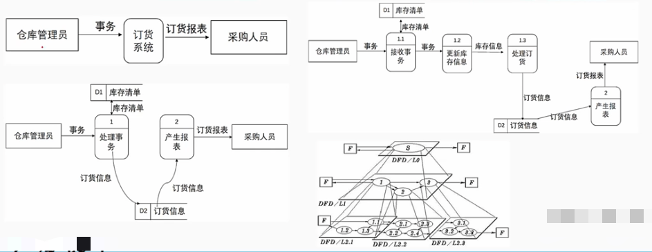
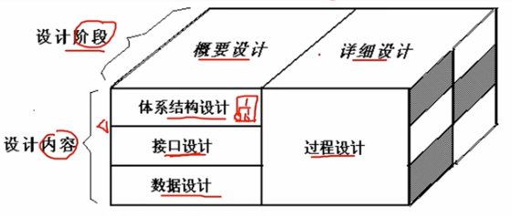
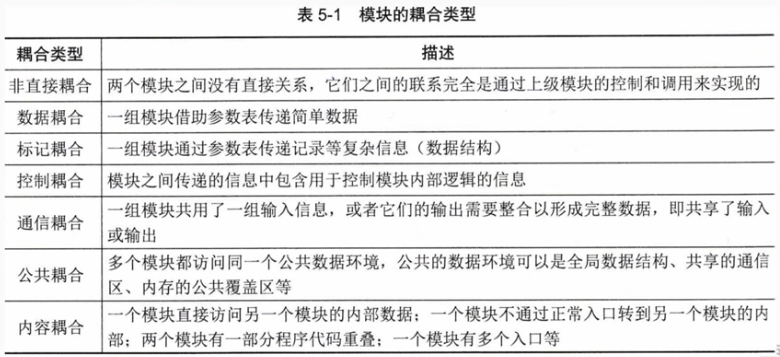

# 5.3 软件工程-系统分析与设计

> 系统分析的基本任务是充分了解用户需求的基础上，把对新系统的理解表达为系统需求规格说明书。

    目标是根据系统分析的结果，完成系统的构建过程。 主要目的是绘制系统的蓝图。劝和和比较各种技术和实施方法
,并选择最佳的技术和实施方法。知道系统工作的顺利开展。

# 1. 结构化方法

        结构化方法是一种面向功能的软件开发方法或面向数据流的软件开发方法。它利用图形表达用户需求，强调开发方法的结构合理性以及所开发软件的结构合理性。
        结构化开发方法提供了一组提高软件结构合理性的准则，如分解与抽象、模块独立性、信息 隐藏等。

## 1.1 结构化分析（SA）

        结构化分析方法给出一组帮助系统分析人员产生功能归约的原理与技术。它一般利用图形表达用户需求，使用的手段主要有数据流图、数据字典、结构化语言、判定表、判定树等。
        结构化分析的常用手段是：数据流图、数据字典

### 1.1.1 数据流图

        DFD建模方法的核心是数据流，从应用系统的数据流着手以图形方式描述数据流从输入到输出的变换过程。

(1) 数据流图由4种基本元素构成：
- 数据流（data flow）：数据流是数据在系统中流动的路径，用箭头表示，箭头的方向表示数据流的方向。
- 加工/处理（process）：处理是数据流的转换，用圆角矩形/ 圆圈表示。
- 数据存储（data store）：数据存储是数据的存放地点，用开口矩形表示。
- 外部实体（external entity）：外部实体是与系统交互的对象，用矩形表示。

### 1.1.2 数据字典

        数据字典是对数据流图中的数据流、数据存储、加工/处理的进一步描述，是数据流图的补充，是数据流图的基础。
        数据字典包括：
        （1）数据结构：数据流图中的数据快的数据结构说明，反映了数据之间的组合关系。数据结构描述 = {数据结构名，含义说明，组成『数据项和数据结构』}
        （2）数据项：数据项是不可再分的数据单位。数据项描述 = {数据项名，数据含义说明，别名，数据类型，数据长度，数据格式，取值范围，与其他数据项的逻辑关系}
        （3）数据流：数据流是数据在系统中流动的路径。数据流描述 = {数据流名，说明，数据流来源，数据流去向，数据流的数据结构，平均流量，高峰期流量}
        （4）数据存储：数据流图中数据块的存储特性说明。数据存储描述 = {数据存储名，说明，编号，流入的数据流，流出的数据流，数据存储的数据结构，数据存储的容量，数据存储的存取方式}
        （5）处理过程：数据流图中加工/处理的功能说明。处理过程描述 = {处理过程名，说明，编号，输入的数据流，输出的数据流，处理过程说明}

## 1.2 结构化设计（SD）

        结构化（SD）设计方法面向数据流的设计方法，它以SRS（需求分析说明书）和SA（结构化分析）阶段产生的数据流图和数据字段等文档为基础，是一个自顶向下、逐步求精的过程。  

### 1.2.1 概要设计

        概要设计是高层设计或总体设计。是将软件需求转化为数据结构和软件的系统结构。

        概要设计包括：
        （1）设计软件的结构
        （2）系统的模块划分
        （3）每个模块间的关系  

### 1.2.2 详细设计

        也称为底层设计，即对结构图进行细化，得到详细的数据结构与算法。详细设计任务是对每个模块进行设计。
        采用自顶向下、逐步求精的设计方式和单入口单出口的控制结构。
        采用的工具包括：
        - 程序流程图
        - 盒图（NS流程图）
        - PAD图（Problem Analysis Diagram,问题分析图）
        - PDL(ProgrmDesign Language,程序设计语言)

### 1.2.3 模块结构

        模块结构是指程序和系统按照功能和其他原则划分为若干个具有一定独立性和大小的模块，每个模块具有某方面的功能。
        模块是组成系统的基本单位，它的特点是可自由组合、分解和变换，系统中任何一个处理功能都可以看成一个模块。
        模块之间互相联系越多，模块的独立性就越少：耦合和内聚
        要去模块之间是“高内聚，低耦合”
        （1）内聚
        表示模块内部个代码成分之间联系的紧密程度。一个好的内聚模块应当恰好做目标电仪的一件事情。

        （2）耦合
        表示模块之间联系的紧密程度。耦合度越低，模块的独立性越高，模块的可重用性越好 。

### 1.3 信息隐藏与抽象

        信息隐藏原则要求采用封装技术，将程序模块的实现细节（过程或数据）隐藏起来，只向外界提供接口，使模块之间的耦合度降低，模块的独立性提高，从而提高软件的可维护性和可重用性。 
        系统中的模块应设计成“黑盒”，模块外部只用按照接口说明使用。
        抽象原则：要求抽取事务最基本的特性和行为，忽略非本质的细节，采用分层次抽象的方式可以控制软件软件开发过程的复杂性，有利于软件的维护和重用。抽象包括：过程抽象、数据抽象、控制抽象。