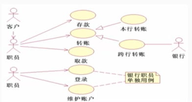

# 5.3 软件工程-系统分析与设计

> 系统分析的基本任务是充分了解用户需求的基础上，把对新系统的理解表达为系统需求规格说明书。

    目标是根据系统分析的结果，完成系统的构建过程。 主要目的是绘制系统的蓝图。劝和和比较各种技术和实施方法
,并选择最佳的技术和实施方法。知道系统工作的顺利开展。

# 1. 结构化方法

        结构化方法是一种面向功能的软件开发方法或面向数据流的软件开发方法。它利用图形表达用户需求，强调开发方法的结构合理性以及所开发软件的结构合理性。
        结构化开发方法提供了一组提高软件结构合理性的准则，如分解与抽象、模块独立性、信息 隐藏等。

## 1.1 结构化分析（SA）

        结构化分析方法给出一组帮助系统分析人员产生功能归约的原理与技术。它一般利用图形表达用户需求，使用的手段主要有数据流图、数据字典、结构化语言、判定表、判定树等。
        结构化分析的常用手段是：数据流图、数据字典

### 1.1.1 数据流图

        DFD建模方法的核心是数据流，从应用系统的数据流着手以图形方式描述数据流从输入到输出的变换过程。

(1) 数据流图由4种基本元素构成：
- 数据流（data flow）：数据流是数据在系统中流动的路径，用箭头表示，箭头的方向表示数据流的方向。
- 加工/处理（process）：处理是数据流的转换，用圆角矩形/ 圆圈表示。
- 数据存储（data store）：数据存储是数据的存放地点，用开口矩形表示。
- 外部实体（external entity）：外部实体是与系统交互的对象，用矩形表示。

### 1.1.2 数据字典

        数据字典是对数据流图中的数据流、数据存储、加工/处理的进一步描述，是数据流图的补充，是数据流图的基础。
        数据字典包括：
        （1）数据结构：数据流图中的数据快的数据结构说明，反映了数据之间的组合关系。数据结构描述 = {数据结构名，含义说明，组成『数据项和数据结构』}
        （2）数据项：数据项是不可再分的数据单位。数据项描述 = {数据项名，数据含义说明，别名，数据类型，数据长度，数据格式，取值范围，与其他数据项的逻辑关系}
        （3）数据流：数据流是数据在系统中流动的路径。数据流描述 = {数据流名，说明，数据流来源，数据流去向，数据流的数据结构，平均流量，高峰期流量}
        （4）数据存储：数据流图中数据块的存储特性说明。数据存储描述 = {数据存储名，说明，编号，流入的数据流，流出的数据流，数据存储的数据结构，数据存储的容量，数据存储的存取方式}
        （5）处理过程：数据流图中加工/处理的功能说明。处理过程描述 = {处理过程名，说明，编号，输入的数据流，输出的数据流，处理过程说明}

## 1.2 结构化设计（SD）

        结构化（SD）设计方法面向数据流的设计方法，它以SRS（需求分析说明书）和SA（结构化分析）阶段产生的数据流图和数据字段等文档为基础，是一个自顶向下、逐步求精的过程。  

### 1.2.1 概要设计

        概要设计是高层设计或总体设计。是将软件需求转化为数据结构和软件的系统结构。

        概要设计包括：
        （1）设计软件的结构
        （2）系统的模块划分
        （3）每个模块间的关系  

### 1.2.2 详细设计

        也称为底层设计，即对结构图进行细化，得到详细的数据结构与算法。详细设计任务是对每个模块进行设计。
        采用自顶向下、逐步求精的设计方式和单入口单出口的控制结构。
        采用的工具包括：
        - 程序流程图 PFD (Program Flowchart Diagram)
        - 盒图（NS流程图）
        - PAD图（Problem Analysis Diagram,问题分析图）
        - PDL(ProgrmDesign Language,程序设计语言)

### 1.2.3 模块结构

        模块结构是指程序和系统按照功能和其他原则划分为若干个具有一定独立性和大小的模块，每个模块具有某方面的功能。
        模块是组成系统的基本单位，它的特点是可自由组合、分解和变换，系统中任何一个处理功能都可以看成一个模块。
        模块之间互相联系越多，模块的独立性就越少：耦合和内聚
        要去模块之间是“高内聚，低耦合”
        （1）内聚
        表示模块内部个代码成分之间联系的紧密程度。一个好的内聚模块应当恰好做目标电仪的一件事情。

        （2）耦合
        表示模块之间联系的紧密程度。耦合度越低，模块的独立性越高，模块的可重用性越好 。

        （3） 信息隐藏与抽象

        信息隐藏原则要求采用封装技术，将程序模块的实现细节（过程或数据）隐藏起来，只向外界提供接口，使模块之间的耦合度降低，模块的独立性提高，从而提高软件的可维护性和可重用性。 
        系统中的模块应设计成“黑盒”，模块外部只用按照接口说明使用。
        抽象原则：要求抽取事务最基本的特性和行为，忽略非本质的细节，采用分层次抽象的方式可以控制软件软件开发过程的复杂性，有利于软件的维护和重用。抽象包括：过程抽象、数据抽象、控制抽象。

        （4） 系统结构图

        又称模块结构图，是概要设计阶段的工具，是反应系统的功能实现和模块之间的联系和通信，包括模块间的层次结构，反应了系统的总体结构。

 

### 1.2.3 数据库设计

        数据库设计内容包括：需求分析、概要结构设计、逻辑结构设计、物理设计、数据库的实施和数据库的运行维护。  

# 2. 面向对象方法

        面向对象（OO）开发方法讲面向对象的思想应用于软件开发过程中，指导开发活动，是建立在“对象”概念基础上的方法学。
        面向对象卡法方法认为客观世界时有对象组成的，对象由对象名、属性和是操作（方法）组成，对象可按照属性分类：对象之间的联系通过消息传递来实现。
        对象具有封装性、继承性和多态性。

        面向对象开发方法是用例驱动的、以体系架构为中心的、迭代的和渐增式的开发过程。
        面相对象的方法有OOA(面向对象分析)、OOD(面向对象设计)、OOP(面向对象编程)三个部分组成。
        OOA，OOD统一采用UML（统一建模语言）来描述并记录。

## 2.1 面向对象分析（OOA）

        OOA模型由5个层次：主题层、对象类层、结构层、属性层、服务层
        5个活动：标识对象类、标识结构、定义主题、定义属性、定义服务。
        OOA定义了两种对象类之间的结构：
        分类结构：就是一般于特殊的关系。
        组装结构：反映了对象之间的整体与部分的关系。

        （1）OOA原则
        - 抽象：从许多事务中舍弃个别的、非本质的特征，收取共同的、本质性的特征叫做抽象。
        抽象包括：过程抽象和数据抽象两方面。
        过程抽象：一个确定功能的操作序列，是对一组操作的抽象。
        数据抽象：是对数据的抽象，是对数据的描述，包括数据的类型、数据的值、数据的操作。

        - 封装：把对象的竖向和操作结合成一个不可分的系统单元，并尽可能隐蔽对象的内部细节。

        - 继承：特殊类的对象拥有一般类的对象的所有特征和行为。特殊对一般的继承。是系统模型简练、清晰。

        - 多态：同一消息可以作用于不同的对象，并产生不同的行为.

        - 分类：把具有相同特征的对象归为一类，是一种抽象的过程。

        - 聚合：又称组装，把一个复杂的事物看成若干比较简单的事物的组整体，简化对复杂事物的描述。

        - 关联：通过一个事物联想到另一个事物，是一种关系。

        - 消息通信：对象之间的联系通过消息传递来实现。  

        - 粒度控制：纵观全局，有能洞察秋毫。控制自己的视野，考虑全局是，注意起大的组成部分，暂时不详察每一部分的细节；考虑部分是暂时撇开全局，详细考察每一部分的细节。

        - 行为分析：是指对对象的行为进行分析，包括对象的状态、状态转换、状态转换的条件、状态转换的动作。

        （2）面向对象的设计OOD

        类封装了信息和行为，是面向对象的重要组成部分，它是具有相同属性、方法和关系的对象集合的总称。在定义类时，将类的属性用于封装数据，方法用于封装行为。

        类分为：实体类、控制类、边界类

        - 实体类：映射为需求中的每个实体，实体类是需要存储在永久存储体中的信息，例如：学生、教师、课程、成绩等。
        实体类对用户来说具有实际的意义的类，通常采用业务领域术语命名，一般是一个名词。在用例模型详领域模型的转化中，一个参与者一般对一个于实体类。通常可以从SRS中的哪些数据库表对应的名词来找寻实体类。
        实体类具一定由属性但不一定有方法（操作）。

        - 控制类：控制用例工作的类，一般来说是 动词+名词 的形式，用例“身份验证”对应一个控制类“身份验证器”，它提供了于身份证有关的所有操作。
        控制类将用例的特有行为进行封装，就控制对象的行为与特定用例的实现密切相关，当系统执行用例的时候，就产生了一个控制对象，控制对象经常在它对应用的用例执行完完毕后消亡。
        控制类没有属性，但一定有方法（操作）。

        - 边界类：系统与外界的交接处。用于封装在用例内、外流动的信息数据流。例如：输入框体、报表、通信协议、打印机、扫描仪接口、传感器等。
        要寻找和定义边界类，可以检查用例模型，每个参与者和用例交互至少要有一个边界类，边界类使参与者能与系统交互
        边界类既有属性也有方法（操作）。

