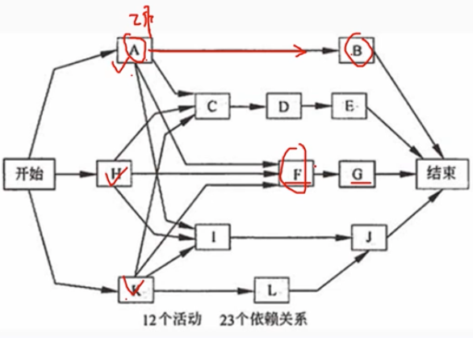
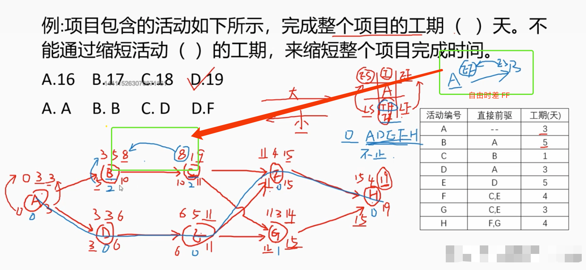
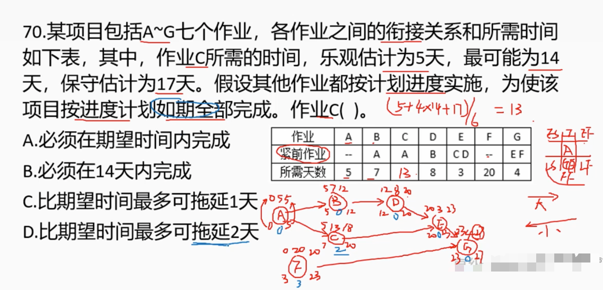

# 5.7 软件工程-软件项目管理

# 1. 项目管理概述

        软件项目管理是为了软件项目能够按照预定的成本、进度、质量顺利完成。对人员    （People）、产品（Product）、过程（Process）和项目（Project）进行分析管理的活动

# 2. 项目进度管理（时间管理）

        进度管理是为了确保项目按期完成所需要的管理过程。
        进度管理的主要活动过程：
        1. 活动有意义
        2. 活动顺序
        3. 活动资源估算
        4. 活动历史估算
        5. 指定进度计划
        6. 进度控制

## 2.1 工作分解结构

        WBS (Work Breakdown Structure) 工作分解结构划分：
        项目->任务->工作->日常活动

        工作分解基本要求：
        1. WBS的工作包是可控和可管理的，不能过于复杂。  < 8 天 || < 80小时
        2. 人不不能郭旭，WBS属性结构不能超过7层
        3. 每个工作包有一个交付成果。
        4. 每个任务必须有明确定义的完成标准。
        5. WBS必须有利于责任分配。

# 3 任务活动图

        互动定义式是指确定完成项目的各个交付成果所必须进行的各项具体活动，明确每个活动的前驱、持续时间、必须完成日期、里程碑或交付成果。
        表示方法：
        1. 前导图（单代号网路图法）
        2. 箭线图（双代号网路图法）

## 3.1 前导图

        前导图法（PDM）——单代号网路图法（AON）
        节点表示活动，箭线表示逻辑关系
         

## 3.2 箭线图

        箭线图法（ADM）——双代号网路图法
        箭线：表示工作，需要占用时间，消耗资源
        虚箭线：表示逻辑关系虚设的工作，不占用时间，不消耗资源
        节点：表示逻辑关系

## 3.3 活动的时间计算

        1. 最早开始时间（ES）：活动开始的最早时间
        2. 最早完成时间（EF）：活动完成的最早时间 EF = ES + 工期估计
        3. 最晚结束时间（LF）：为了使项目按时完成，某项工作必须完成的最晚时间
        4. 最晚开始时间（LS）：为了使项目按时完成，某项工作必须开始的最晚时间 LS = LF - 工期估计

        正向计算：推出最早完成时间（EF）。选大的往后+工期估计
        反向计算：推出最晚开始时间（LS）。选小的往前-工期估计

        TF = 总时差，不影响总工期的前提下，可以利用的机动时间
        TF = LF - EF = LS - ES
        FF = 自由时差，不影响后续活动最早开始时间的前提下，可以利用的机动时间
        FF = ES - EF 后续活动的最早开始时间 - 当前活动的最早完成时间，存在多个后续活动时，取最小值
        
        TF = 0，表示关键路径，关键路径可能有多条
 
        FF <= TF 自由时差 <= 总时差 TF

        不能缩短非关键路径的时间来缩短项目的总工期
        只能缩短关键路径的时间来缩短项目的总工期

