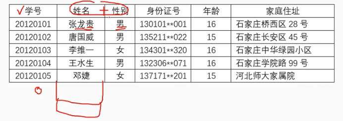

# 6.2 数据库基础知识-关系数据库

# 1. 关系数据库基础概念

## 1.1 关系的基本术语

        - 属性（Atribute）
        描述一个事物尝尝取若干特征来表示。这些特征称为属性。
        - 域（Domain）
        每个属性的取值范围对应一个值的集合，称为该属性的域。所有的域都应是原子数据。
        - 目或度（Degree）
        指一个关系中属性的个数。
        - 候选码（Candidate Key）
        若关系中的某一属性或属性组的只能唯一的标识一个元组称改属性或属性组未候选码。
        - 主码（Primary Key）
        或称主键，若一个关系有多个候选码，则选定一个作为主码。
        - 主属性（Primary Attribute）
        包含在任何候选码中的属性称为主属性。不包含在任何候选码中的属性称为非主属性。
        - 外码（Foreign Key）
        如果关系中的一个属性是另一个关系的主码，则称该属性为外码。也称为外键。

        - 全码（Super Key）
        一个关系中所有属性的集合称为全码。

## 1.2 关系的模型

       关系模式是一个五元组，包括关系名、属性名、域、主码、外码。
       表示为：R(U,D,DOM,F) 
       - R为关系名
       - U为属性名
       - D为域
       - DOM为属性的取值范围
       - F为外码,属性间的数据依赖关系集合
       记为：R(A1,A2,...,An) R 关系名，A1,A2,...,An为属性名

## 1.3 关系的完整性约束

        （1）实体的完整性(entity integrity)
        关系中的主键不能重复，不能取空值。
        如主键字是多个属性的组合，则所有主属性均不得取空值。

        （2）参照完整性（referential integrity）
        是指建立关系之间联系的主键与外键引用的约束条件。就是不允许引用不存在的主体。

      

        （3）用户自定义完整性（user defined intefrity）
        根据应用环境的要求和实际的需要，对某一具体应用所涉及的数据的完整性约束条件。

   
