# 6.2 数据库基础知识-关系数据库

# 1. 关系数据库基础概念

## 1.1 关系的基本术语

        - 属性（Atribute）
        描述一个事物尝尝取若干特征来表示。这些特征称为属性。
        - 域（Domain）
        每个属性的取值范围对应一个值的集合，称为该属性的域。所有的域都应是原子数据。
        - 目或度（Degree）
        指一个关系中属性的个数。
        - 候选码（Candidate Key）
        若关系中的某一属性或属性组的只能唯一的标识一个元组称改属性或属性组未候选码。
        - 主码（Primary Key）
        或称主键，若一个关系有多个候选码，则选定一个作为主码。
        - 主属性（Primary Attribute）
        包含在任何候选码中的属性称为主属性。不包含在任何候选码中的属性称为非主属性。
        - 外码（Foreign Key）
        如果关系中的一个属性是另一个关系的主码，则称该属性为外码。也称为外键。

        - 全码（Super Key）
        一个关系中所有属性的集合称为全码。

## 1.2 关系的模型

       关系模式是一个五元组，包括关系名、属性名、域、主码、外码。
       表示为：R(U,D,DOM,F) 
       - R为关系名
       - U为属性名
       - D为域
       - DOM为属性的取值范围
       - F为外码,属性间的数据依赖关系集合
       记为：R(A1,A2,...,An) R 关系名，A1,A2,...,An为属性名

## 1.3 关系的完整性约束

        （1）实体的完整性(entity integrity)
        关系中的主键不能重复，不能取空值。
        如主键字是多个属性的组合，则所有主属性均不得取空值。

        （2）参照完整性（referential integrity）
        是指建立关系之间联系的主键与外键引用的约束条件。就是不允许引用不存在的主体。

      

        （3）用户自定义完整性（user defined intefrity）
        根据应用环境的要求和实际的需要，对某一具体应用所涉及的数据的完整性约束条件。

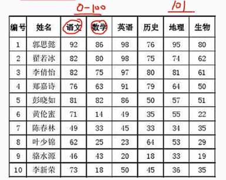   

# 2. 常用的关系操作

## 2.1 基本操作

        - 查询：选择、投影、连接、除、并、交、差
        - 更新：插入、删除、修改
        查询的表达能力是其中最主要的部分
        - 传统的集合运算是二目运算，包括并、交、差、广义笛卡尔积
        - 专门的关系运算包括：选择、投影、连接、除

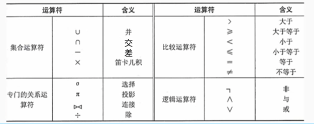

        1. 并

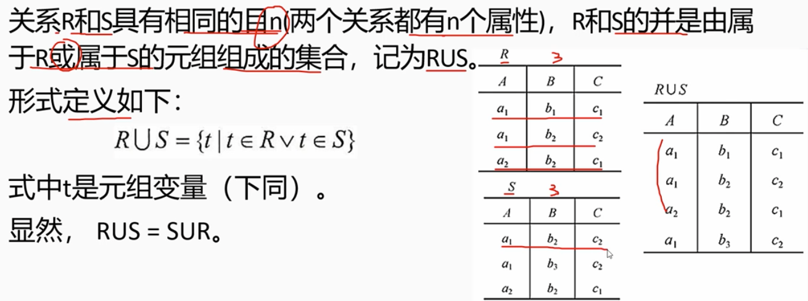

        2. 差

        3. 交

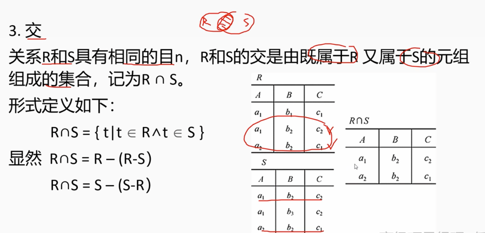

        4. 笛卡尔积

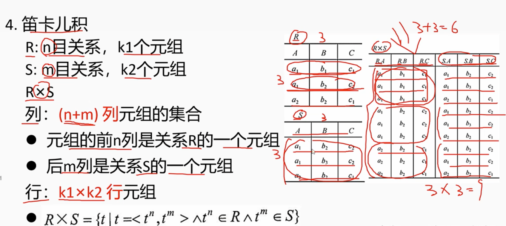

# 3. 关系运算

        关系运算：选择、投影、连接、除和外连接

        在关系代数中，关系运算是对关系的操作，其结果仍然是关系。

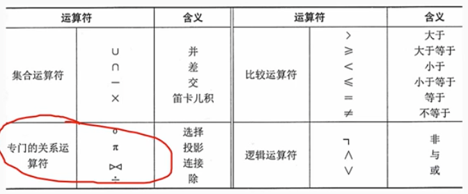

        1. 投影

        投影操作从关系R中选取若干属性组成新的关系，该操作对关系进行垂直分割，消去某些列，并重新安排列的顺序，再删去重复的元组。
        注意：投影之后不仅取消了原关系中的某些列，而且还可能取消某哦写元组（避免重复行）。

 

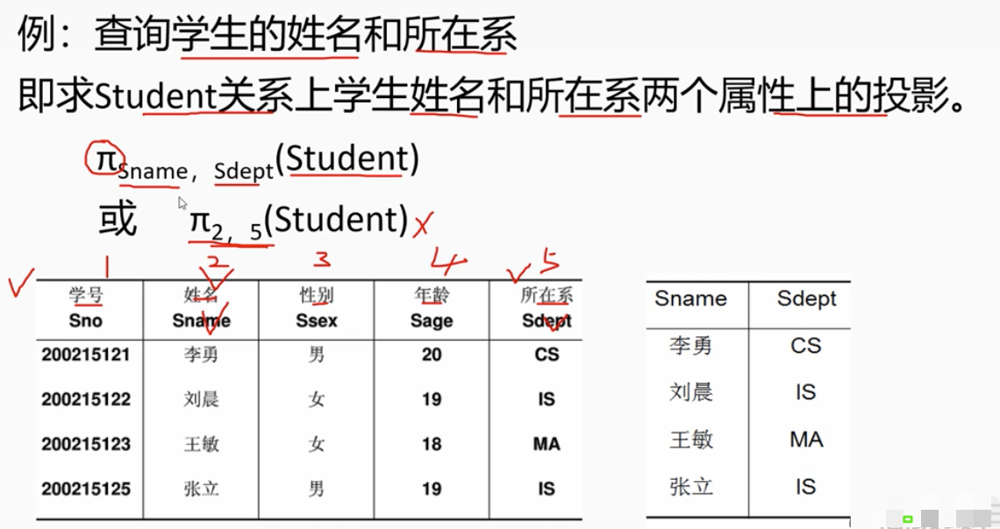 

        2. 选择

        选择操作从关系R中选取满足某一条件的元组组成新的关系，该操作对关系进行水平分割，消去某些行。

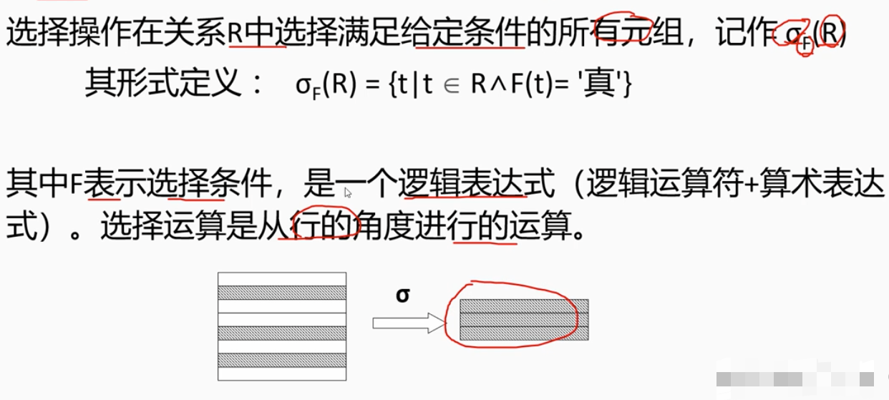

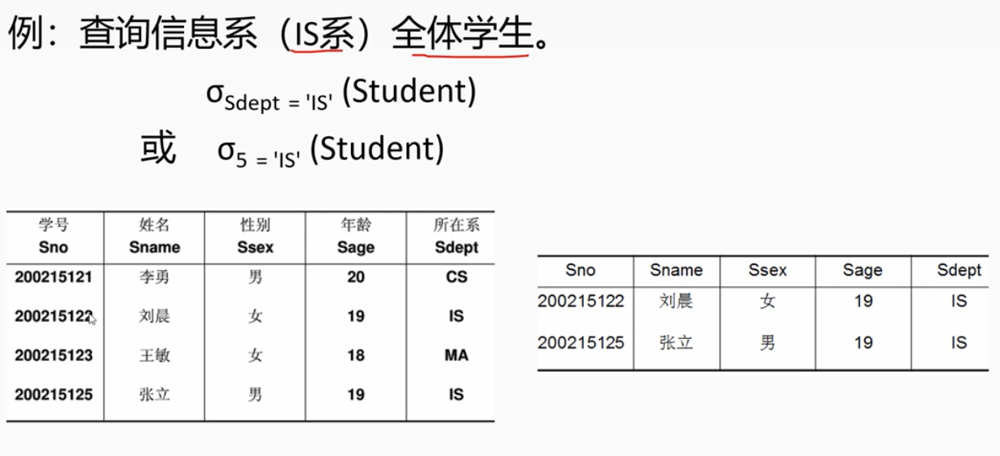

        3. 连接

        连接分为Θ连接、等值连接及自然连接。
        连接运算是指从两个关系R和S的笛卡尔积中选取属性间满足一定条件的元组。
        

        3.1 Θ连接，表示连接条件，可以是等号、不等号、大于、小于、大于等于、小于等于等。

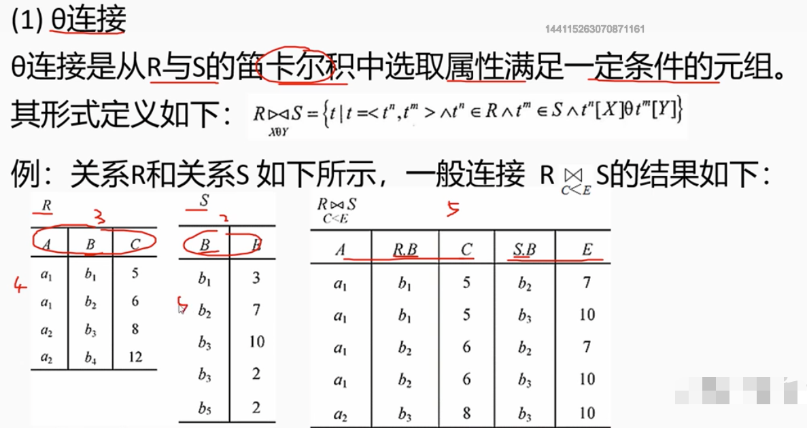

        3.2 等值连接，是指连接条件是等号的连接。

        3.3 自然连接，是指连接条件是等号的连接，且连接的属性只出现一次。

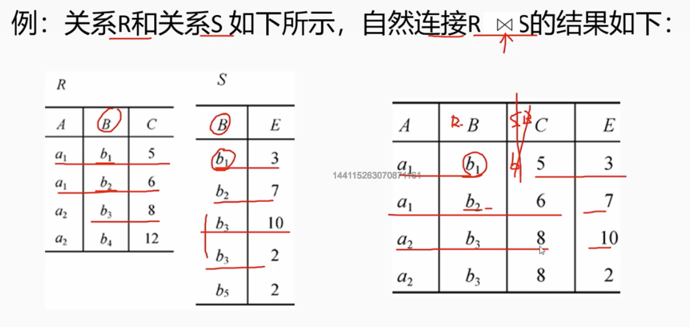

        4. 外连接

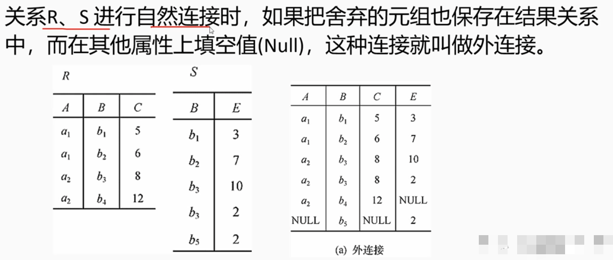

        5. 左外连接

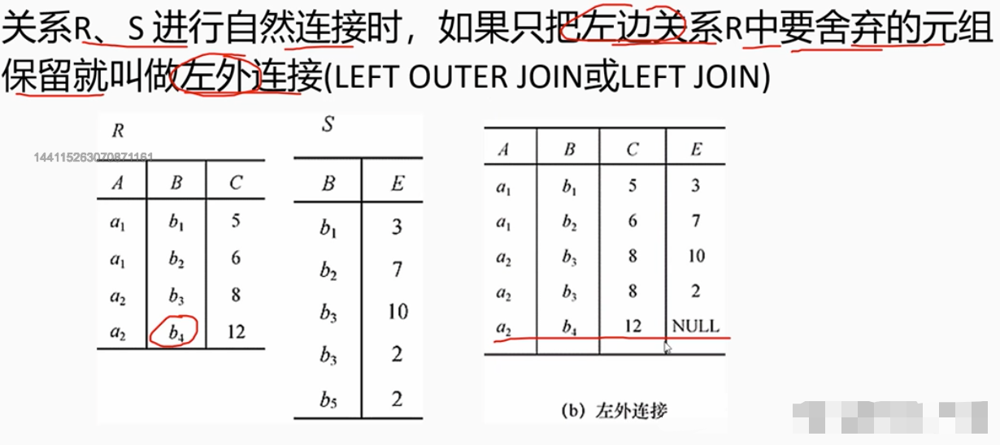

        6. 右外连接
        
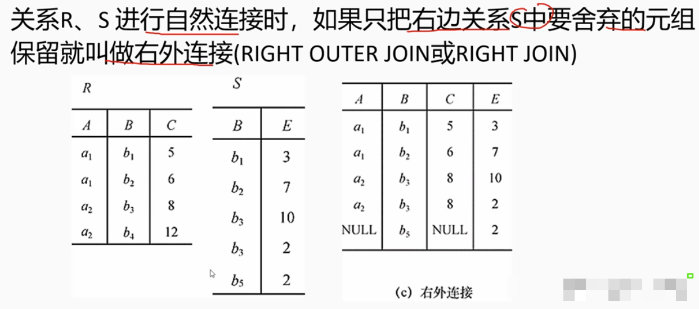

        7. 除法

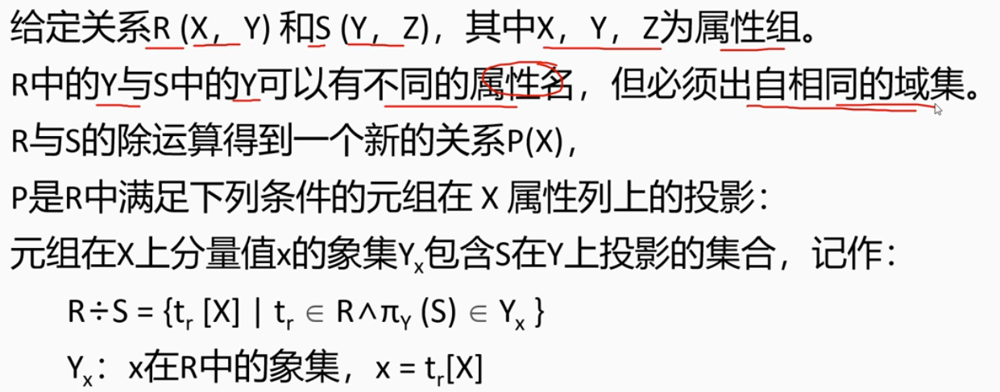
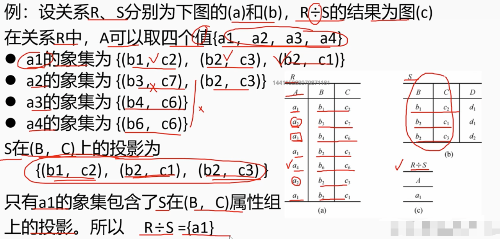
