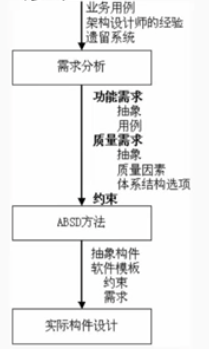
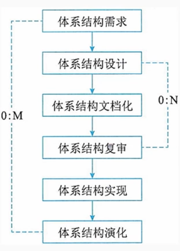
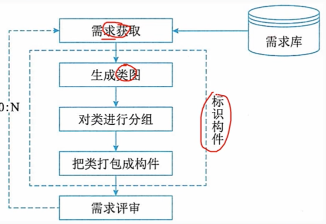
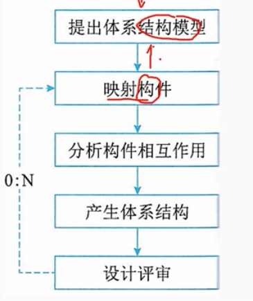
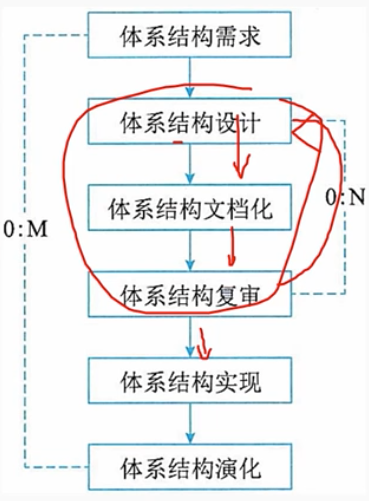
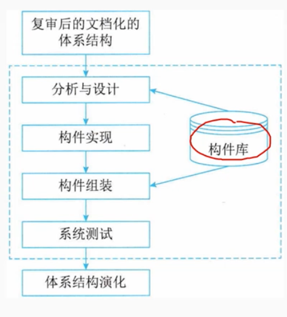
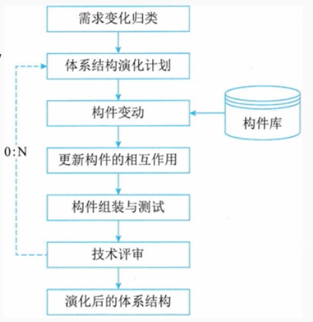

# 7.2 系统架构设计基础知识-基于架构的软件开发方法

## 1. 体系架构的设计方法（ABSD Architecture-Based Software Design）概述

    ABSD 方法是有体系架构驱动的。
    即指构成体系架构的 商业、质量和功能需求 的组合驱动的。
    
    ABSD方法有3个基础：
    - 基础功能的分解。在功能分解中，ABSD方法使用已有的基于模块的内聚和藕合技术。
    - 通过选择体系架构风格来实现质量和商业需求。
    - 软件模板的使用，软件模板包括描述所有这种类型的元素在共享服务和底层构造的基础上如何进行交互。

## 2. 概念和术语

### 2.1 设计元素

        ABSD方法是一个自定向下，递归细化的方法。
        直到产生软件构件和类。
        在最顶层，系统被分解为若干概念子系统和一个或若干个软件模板。
        在第二层，概念子系统又被分解成概念构件和一个或若干个附加软件模板。

>例题

### 2.2 视角和视图

        考虑体系架构时，要从不同的视角来观察对架构的描述，这需要软件设计师考虑体系架构的不同属性。
        例如，展示功能组织的静态视角能判断质量特性，展示并发行为的动态视角能判断系统行为特性。
        因此，选择特定视角或视图（如逻辑视图、进程视图、实现视图和配置视图）可以全方位的考虑体系架构设计。
        使用逻辑视图来记录设计元素的功能和概念接口，设计元素的功能定义了它本身在系统中的角色，这些角色包括功能、性能等
        
### 2.3 用例和质量场景

        用例是系统给予用户的一个结果值的功能点，用例用来捕获功能需求。在使用用例捕获功能需求的同时，人们通过定义特定场景来捕获质量需求，并称这些场景为质量场景。
        这样一来，在软件开发过程中，人们使用质量场景捕获变更、性能、可靠性和交互性，分别称之为变更场景、性能场景、可靠性场景和交互性场景。

        质量场景必须包括预期的和非预期的场景。
        例如，一个预期的性能场景是估计每年用户数量增加10%的影响，一个非预期的场景是估计每年用户数量增加100%的影响。
        非预期场景可能不会真正实现，但它在决定设计的边界条件时很有用。

## 3。基于体系架构的开发模型

        （1）体系架构需求
        （2）体系架构设计
        （3）体系架构文档化
        （4）体系架构复审
        （5）体系架构实现
        （6）体系架构演化

### 3.1 体系架构需求

        需求过程主要是获取用户需求，表示系统中要用到的构建。架构需求分为需求获取、标识构件和需求评审3个步骤。

### 3.2 体系架构设计

        体系架构设计是一个迭代过程，分为提出软件架构模型、把已标识的构建映射到软件架构中、分析构建之间的相互作用、产生软件体系架构及设计评审。

### 3.3 体系架构文档化

        文档是系统演化的每个阶段、系统设计与开发人员的通信媒介，是为验证体系架构设计和提炼或修改这些设计所执行预先分析的基础。
        体系架构文档主要输出：架构需求规格说明书、测试架构需求的质量设计说明书。

### 3.4 体系架构复审

        体系架构设计、文档化、复审是一个迭代过程。
        复审有外部人员（用户代表和专家）进行。
        复审的目的是表示潜在的风险，及时发现体系架构设计中的缺陷和错误，包括体系架构能否满足需求、质量需求是否存在设计中得到体现、层次是否清晰、构件的划分是否合理、文档表达是否明确、构件的设计是否满足功能与性能的要求等。

### 3.5 体系架构的实现

        实现的过程已复审后的文档化的架构说明书为基础，在架构说明书中，已经定义了系统中的构建及他们间的关系，可以从构件库中查找符合结构约束的构件，必要时开发新的满足要求的构建。然后，按照设计提供的结构，通过组装支持工具把这些构建的实现体组装起来，完成整个系统的连接与合成。

### 3.6 体系架构的演化

        在构件开发过程中，用户的需求可能有变动，需要相应地修改软件体系架构，以适应已发生变化的软件需求

