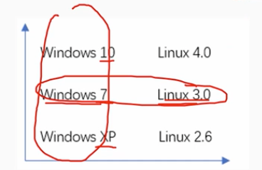
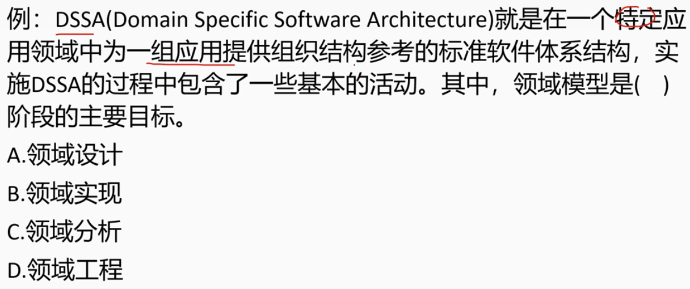
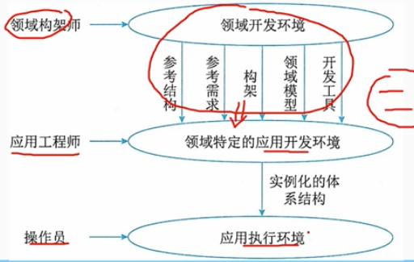

# 7.5 系统架构设计基础知识-特定领域软件体系架构

## 1. 特定领域软件架构DSSA

        DSSA (DomainSpecificSoftwareArchitecture)

        特定领域软件架构，是在一个特定领域中，为一组应用提供参考架构的标准软件框架。
        其目标是支持在一个特定领域中多个应用的生成。

        DSSA中领域的含义：
        （1）垂直域。定义一个特定的系统族，包含整个系统族内的多个系统，结果是该领域中可作为系统的可行解决方案的一个通用软件架构。
        （2）水平域。定义了在多个系统和多个系统族中功能区域的共有部分，在子系统上涵盖多个系统族的特定部分功能，无法为系统提供完整的通用架构。

### 1.1 DSSA的基本活动

        （1）领域分析：主要目的是获得领域模型。领域模型描述领域中系统之间的共同需求，所描述的需求为领域需求。
        （2）领域设计：主要目的是获得DSSA。DSSA描述在领域模型中表示需求的解决方案，他不是单个系统的表示，而是能够适应领域中多个系统需求的一个高层次的设计。
        （3）领域实现：主要目的是依据领域模型及DSSA开发和组织可重用信息。

> 例题

### 1.2 参与DSSA的人员

        领域专家：有经验的用户、从事该领域中系统的需求分析、设计、实现以及项目管理的有经验的软件工程师。
        领域分析师：具有知识工程背景的有经验的系统分析员来担任。
        领域设计人员：由有经验的软件设计人员来担任。
        领域实现人员：由有经验的程序设计人员来担任。

### 1.3 DSSA的建立过程

        5个阶段，这些阶段是并发、递归、反复、螺旋的。
        （1）定义领域范围：主要输出是领域中应用需要满足一些列用户的需求
        （2）定义领域特定的元素：编译领域字典和领域术语的同义词词典。
        （3）定义领域特定的设计和实现需求约束。
        （4）定义领域模型和架构。
        （5）产生、搜集可重用的产品单元。

        DSSA包含两个过程：
        - 领域工程：为一组相近或相似的应用建立基本能力与必备基础的过程，它覆盖了简历可重用软件元素的所有活动。
        - 应用工程：通过重用软件资源，以领域通用体系架构为框架，开发出满足用户需求的一系列应用软件的过程。

