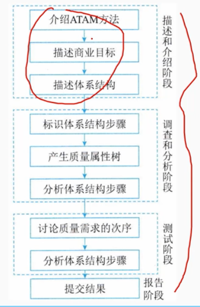
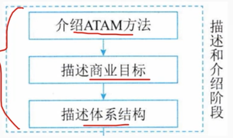
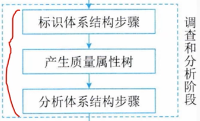
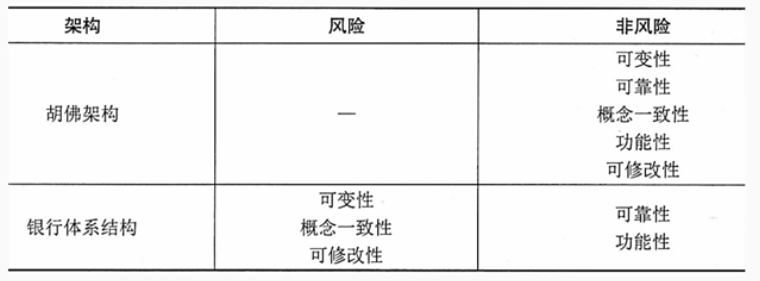
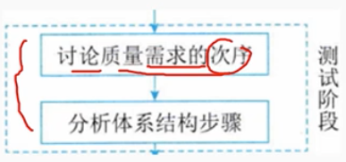
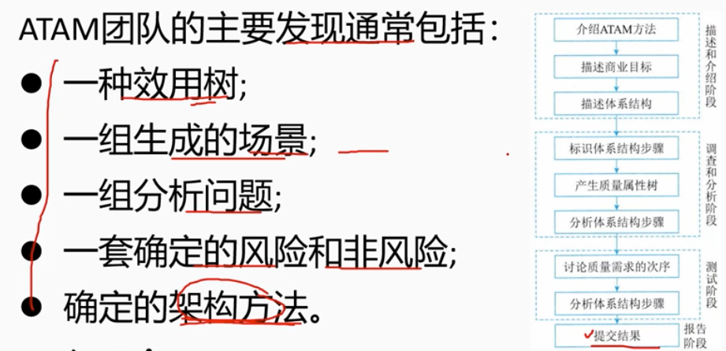

# 8.3 系统质量属性与架构评估-ARAM方法架构评估实践

        ARAM方法架构评估4个阶段：
        - 描述和介绍阶段（演示）
        - 调查和分析阶段
        - 测试阶段
        - 报告阶段

### 1 描述和介绍阶段(演示)

        此阶段分为3个步骤：
        第1步：介绍ATAM
        涉及ATAM评估过程的描述。在此步骤中，评估负责人向素有相关参与者提供有关ATAM过程的一般信息，领导者说明评估中使用的分析技术以及评估的预期结果。领导者解决小组成员的任何疑虑、期望和问题。

        第2步：介绍业务驱动因素

        提到了系统体系架构驱动程序的业务目标。这一步注重于系统的业务视角。它提供了有关系统功能、主要利益相关方、业务目标和系统其他限制的更多信息。
        主要利益相关方：最终用户、架构师、应用程序开发人员。

        第3步：介绍要评估的体系架构

        架构团队描述要评估的架构。它侧重于体系架构、时间可用性以及体结构的质量要求。
        此步骤中体系机构演示非常重要：会影响分析的质量。
        这里涉及的关键问题包括技术约束、与正在评估的系统交互的其他系统，以及满足质量属性而实施的架构方法。

## 2 调查和分析阶段

        此阶段分为3个步骤：
        第4步：确定架构方法

        理解系统关键需求的关键架构方法。
        架构团队介绍架构的流程控制，并提供关于如何达成关键目标以及是否达到关键目标的适当解释。

        第5步：生成质量属性效用树

        去顶迪信通最重要的竖向目标，并确定有限次序。通过建立效用数树，将所有利益相关方和评估人员的注意力集中在关系到体系成功至关重要的体系架构的不同方面

        第6步：分析体系架构方法

        这是“调查和分析”阶段的最后一步。

        在这一步中，分析前一步生成效用树的输出并进行彻底调查和分析，找出处理响应质量属性架构的方法。
        这里还要确定每种架构方法的风险、非风险、敏感点和权衡点。

## 3 测试阶段

        第7步：头脑风暴和优先场景

        这是ATAM测试阶段的第一步。在这一步中，利益相关方头脑风暴，投票选出最重要的质量属性。这些质量属性将在下一步中进行评估。

        第8步：分析评估方法

        这是测试阶段的最后一步。
        分析上一步高优先级的质量属性，找到这里这些质量属性的架构设计方案。并价差响应的架构设计方案是否可支持满足这些属性。这一步重复“调查和分析”阶段的第6步。唯一的区别在于，高优先级质量属性来自效用数，这一步是考虑头脑风暴中投票数最多的质量属性。

## 4 报告阶段

        这是ATAM最后阶段
        提供了评估期间手机的所有信息，ATAM团队奖他们发现呈现个利益相关者。

