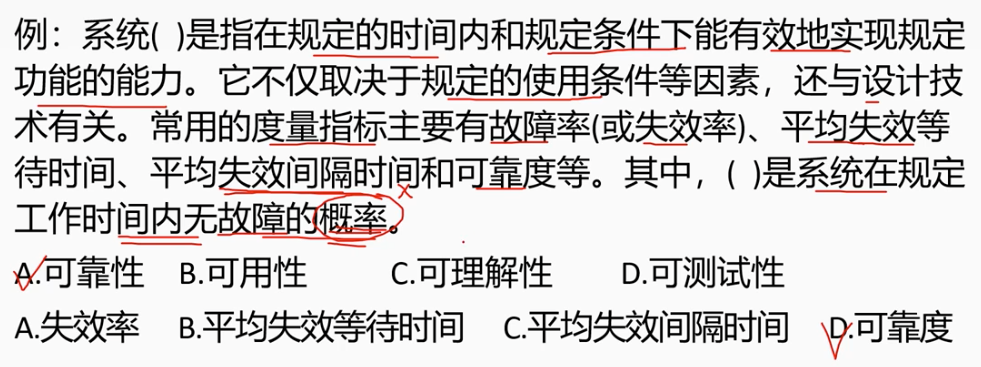
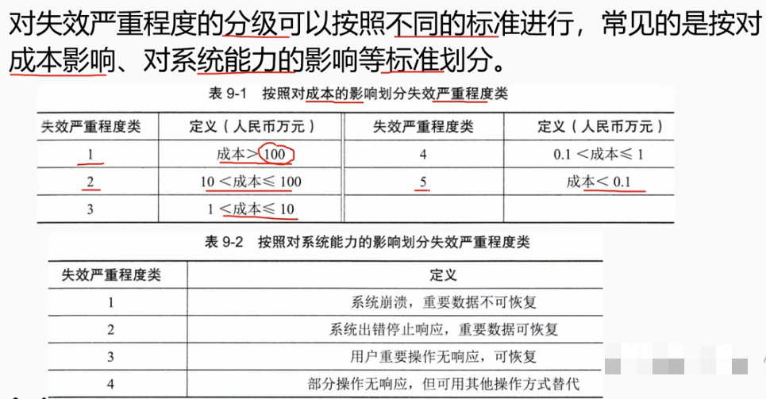
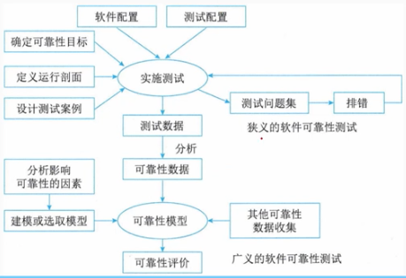
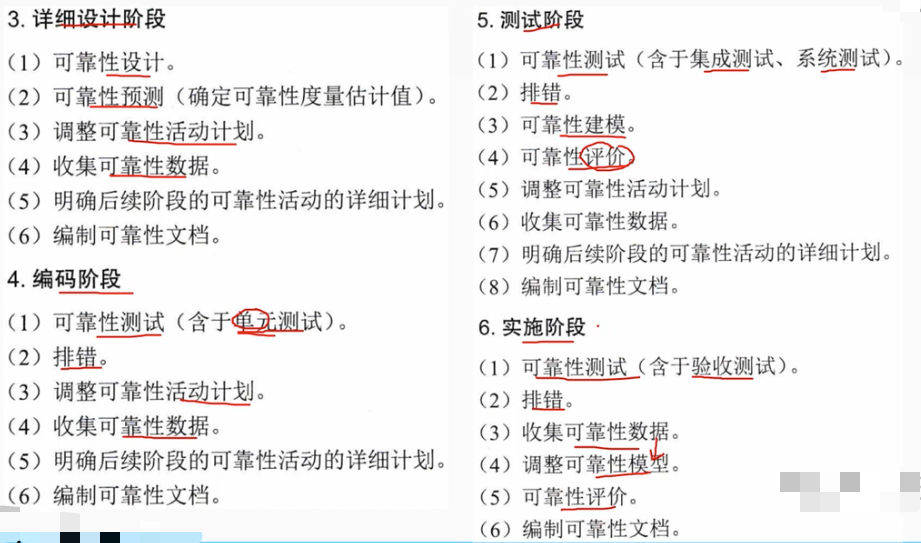
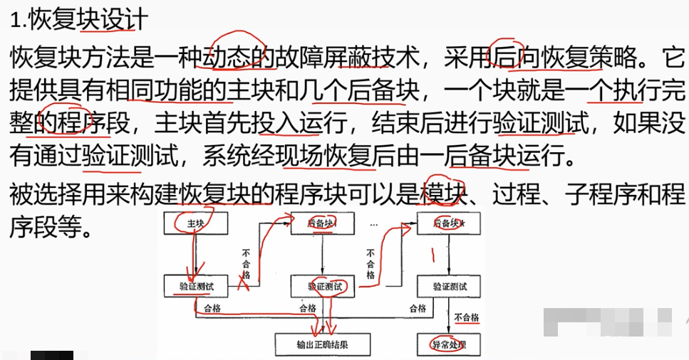
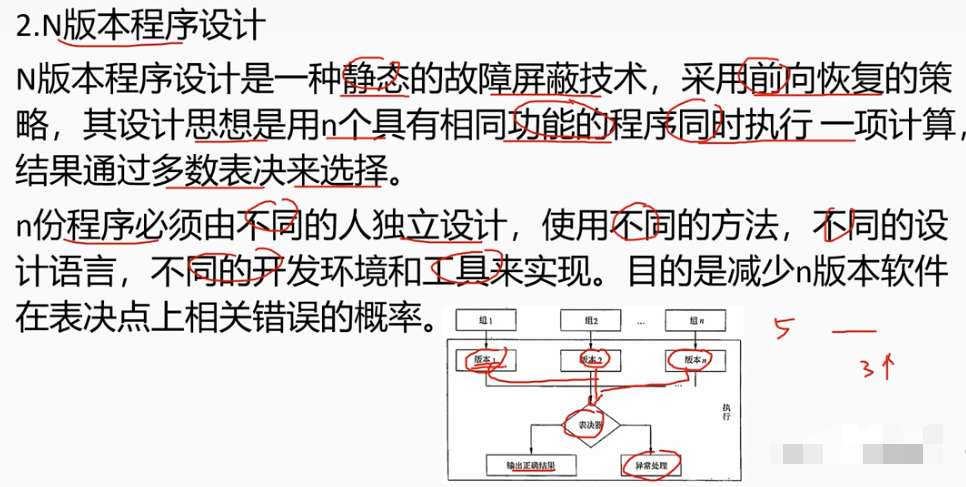
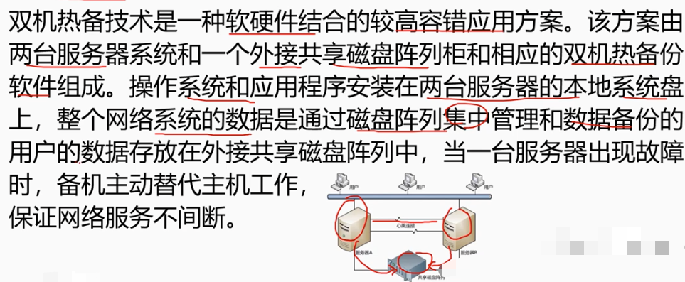
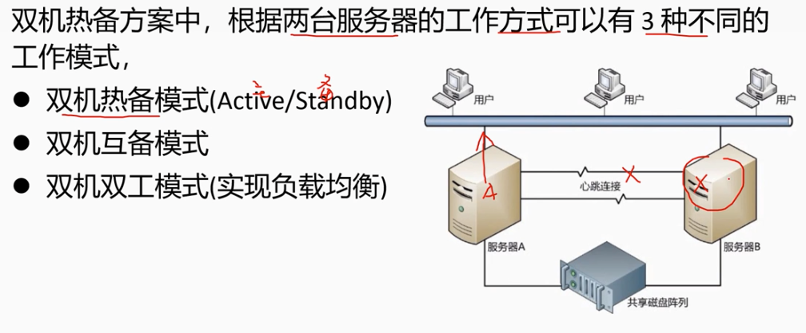
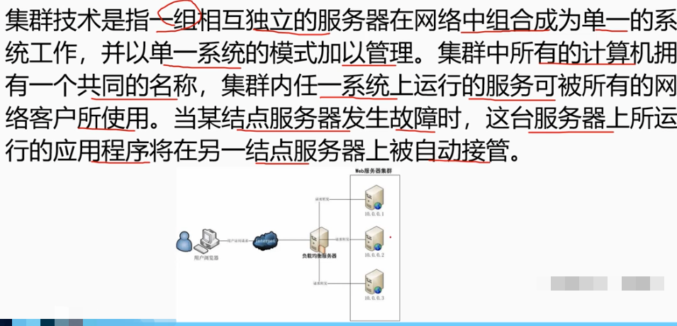
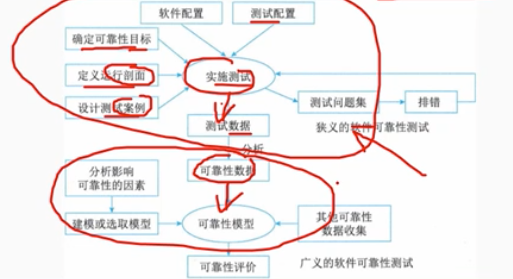

# 9.1 软件可靠性基础-基本概念

## 1. 软件可靠性定义

        软件可靠性是指软件在规定的条件下规定的时间区间完成规定功能的能力。

        规定的条件是指软件运行相关的使用该软件的计算机系统的状态和软件的输入条件，或统称为软件运行时的外部输入条件。

        规定的时间区间是指软件的实际运行时间区间。

        规定功能是指为提供给定的服务，软件产品所必须具备的功能。

## 2. 软件可靠性的定量描述

        软件可靠性的定义可以看到，软件的可靠性可以基于使用条件、规定时间、系统输入、系
        统使用和软件缺陷等变量构件的数学表达式。

        （1）规定时间
        规定时间有3种概念：
        - 自然时间，日历时间
        - 运行时间
        - 执行时间

        （2）失效概率
        从软件运行开始，到某一时刻t为止，出现失效的概率。可以看做是关于软件运行时间的一个随机函数。用F(t)表示。
        或指单位时间内失效的元件数与元件总数的比例。通常用λ表示。

        （3）可靠度
        软件系统在规定条件下、规定时间内不发生失效的概率。
        用R(t)表示，R(t)=1-F(t)。

        （4）失效强度

        (5) 平均失效前时间MTTF

        (6) 平均恢复前时间MTTR

        也叫平均故障修复时间 MTTR，是从出现故障到修复成功中间的这段时间，它包括确认失效发生所必需的时间，记录所有任务的时间，还有将设备重新投入使用的时间。MTTR越小表示易恢复性越好。

        (7) 平均故障间隔时间MTBF
        是指相邻两次故障之间的平均时间，也称为平均故障间隔。
        MTBF=MTTF+MTTR,实际MTTR很小，所以MTBF≈MTTF

> 例题
> 

## 3 可靠性目标

        使用失效强度来表示软件缺陷对软件运行的影响程度。然而在实际情况中，对软件运行的影响程度不仅取决于软件失效发生的概率，还和软件失效的严重程度有很大关系。这里引出另外一个概念-失效严重程度。
        失效严重程度就是对用户具有相同程度影响的失效集合。

## 4 可靠性测试

        广义的软件可靠性测试是为了最终评价软件系统的可靠性而运用建模、统计、实验、分析和评价等一系列手段对软件系统实施的一种测试。一个完整的软件可靠性测试包括：

        狭义的软件可靠性测试是为了获取可靠性数据，按照预定的测试用例，在软件的预期使用环境中，对软件实施的一种测试。
        狭义的软件可靠性测试也叫：软件可靠性实验。是面向缺陷的测试。
        可靠性测试的目的可归纳为以下3个方面：
        （1）发现软件系统在需求、设计、编码、测试和实施等方面的缺陷。
        （2）为软件的使用和维护提供可靠性数据。
        （3）确认软件是否达到可靠性的定量要求。

# 9.2 软件可靠性基础-可靠性建模

## 1. 软件可靠性模型

        软件可靠性模型是指为预计或估算软件的可靠性所建立的可靠性框图和数学模型，为了将复杂系统的可靠性逐级分解为简单系统的可靠性，以便于定量预计、分配、估算和评价复杂系统的可靠性。

        从技术的角度来看，影响软件可靠性的因素如下：
        （1）运行剖面（环境）
        （2）软件规模
        （3）软件内部结构
        （4）软件的开发方法和开发环境
        （5）软件的可靠性投入

## 2. 软件可靠性模型分类

# 9.3  软件可靠性基础-可靠性管理

        可靠性管理是软件工程管理的一部分，它以全面提供和保证软件可靠性为目标，以软件可靠性活动为主要对象，是办现代管理理论用于软件生命周期中的可靠性保障活动的一种管理形式。
        软件可靠性活动是贯穿于软件开发全过程的。

# 9.4  软件可靠性基础-可靠性设计

## 1. 设计原则

        （1）软件可靠性设计师软件设计的一部分，必须在软件的总体设计框架中使用，并且不能与其他设计原则相冲突。
        （2）软件可靠性设计是满足提高软件质量要求的前提下，以提高和保障软件可靠性为最终目标。
        （3）软件可靠性设计应确定软件的可靠性目标，不能无限扩大化，并且排在功能度、用户需求和开发费用之后考虑。

        被认可的且具有应用前景的软件可靠性设计技术主要有：
        - 容错设计技术
        - 检错设计技术
        - 降低复杂度设计技术、
        
### 1.1 容错设计技术

        常用的软件容错技术主要有：
        （1）恢复块设计

        （2）N版本程序设计

        （3）冗余设计

        软件的冗余设计技术实现的原理是在一套完整的软件系统之外，设计一种不同路径、不同算法或不同实现方法的模块或系统作为备份，在出现故障时可以使用冗余的部分进行替换，从而维持软件系统的正常运行。

## 2. 检错技术

        软件出现故障后及时发现并报警，提醒维护人员进行处理。

        检错技术实现的待见一般低于容错技术和冗余技术，但它有一个明显的缺点，就是不能自动解决故障，出现故障后如果不进行人工干预，将最终导致软件系统不能正常运行。
        采用检错技术要着重考虑几个要素：检测对象、检测延时、实现方式和处理方式。

## 3 降低复杂度

        降低复杂度设计的思想就是在保证实现软件功能的基础上，简化软件结构，缩短程序代码度，优化软件数据流向，降低软件复杂度，从而提高软件的可靠性。
        软件复杂性分为模块复杂性和结构复杂性。
        - 模块复杂性助于奥包含模块内部数据流行和程序长度两个方面
        - 结构复杂性用不同募款之间的关联程度来表示

## 4 系统配置技术

        （1）双机热备技术

        （2）服务器集群技术

# 9.5 软件可靠性基础-可靠性测试

## 1. 可靠性测试概述

        传通的软件测试是面向错误的测试，测试所得的数据不能直接用于软件可靠性测试，必须经过一定的分析处理后方可使用可靠性模型进行可靠性评价。
        软件可靠性测试由可靠性目标的确定、运行剖面的开发、测试用例的设计、测试实施、测试结果的分析等活动组成。

## 2. 定义软件运行剖面

        首选需要为软件的使用行为建模，然后是开发使用模型，明确需要测试的内容。
        定义使用概率的最佳方法是实际的用户数据，如来自系统原型、前一版本的使用数据；其次是由该软件应用领域的用户和专家提供的预期使用数据，在没有任何数据可用的情况下，只能是将每个状态现有的弧分配相同的概率，这是最差的一种方法。

## 3. 测试用例设计

        设计测试用例就是针对特定功能或组合功能设计测试方案，并编写成文档。测试用例的选择既要有一般情况，也应有基线情况以及最大和最小的边界值情况。因为测试的目的是暴露应用软件中隐藏的缺陷，所以在设计选择测试用例和数据是要考虑哪些易于发现缺陷的测试用例和数据，结合复杂的运行环境，在所有可能的输入条件和输出条件中确定测试数据，来检查应用软件是否都能产生正确的输出。优先测试哪些最重要或最频繁使用的功能，释放和缓解最高级别的风险，有助于今早发现那些对可靠性有最大影响的故障，以保证软件的按期交付。

        典型的测试用例包括以下内容：
        - 测试用例标识
        - 被测对象
        - 测试环境和条件
        - 测试输入
        - 操作步骤
        - 预期输出
        - 判断输出结果是否符合标准
        - 测试对象的特殊需求

## 4. 测试的实施

        开发方交付的任何软件文档中与可靠性质量特性有关的部分、程序以及数据都应当按照需求说明和质量需求进行测试。在项目合同、需求说明书和用户文档中规定的所有配置情况下，程序和数据都必须进行测试。软件可靠性数据是可靠性评价的基础。为了获得更多的可靠性数据，应该使用多台计算机同时运行软件，以增加累积运行时间。
        应该按照相关标准的要求，指定和实施软件错误报告和可靠性数据收集、保存、分析和处理的规程，完整、准确地记录软件测试阶段的软件错误报告和收集的可靠性数据。
        测试活动结束后要编写《软件可靠性测试报告》，对测试用例及测试结果在测试报告中加以总结归纳。
        测试报告应包括以下内容：
        - 软件产品标识
        - 测试环境配置（硬件和软件）
        - 测试依据
        - 测试结果
        - 测试问题
        - 测试时间

# 9.6 软件可靠性基础-可靠性评价

## 1. 可靠性评价概述

        软件可靠性评价是指选用或建立合适的可靠性数学模型，运用统计计数和其他手段，对软件可靠性测试和系统运行期间收集的软件失效数据进行处理，并评估和预测软件可靠性的过程。
        评价过程包含三个方面：
        1. 选择可靠性模型
        2. 收集可靠性数据
        3. 可靠性评估和预测

## 2. 选择可靠性模型

        对于不同的软件系统，不同的可靠性分析目的，模型的适用性是不一样的。以下是四个方面进行模型的比较和选择。
        1. 模型假设的实用性
        2. 预测的能力与质量
        3. 模型输出值能否满足可靠性评价需求
        4. 模型使用的简便性

## 3. 收集可靠性数据

        面向缺陷的可靠性测试产生的测试数据经过分析后，可以得到非常有价值的可靠性数据，是可靠性评价所用数据的一个重要来源，这部分数据取决于定义的运行剖面和选取的测试用例集。
        可靠性数据主要是指软件失效数据，是软件可靠性评价的基础，主要是在软件测试、实施阶段收集的。
        在软件工程的需求、设计和开发阶段的可靠性活动，也会产生影响较大的其他可靠性数据。因此，可靠性数据的手机工作是贯穿于整个软件生命周期的。

## 4. 可靠性评估和预测

        评估和预测的目的是为了评估软件系统的可靠性状况，预测将来一段时间的可靠性水平。
        目前有不少软件可靠性估计的软件工具，只要将收集的失效数据分类、录入核实的可靠性模型，就可以获得软件可靠性的评价结果。
        软件可靠性评估的预测一软件可靠性模型分析为主，大爷要在模型之外运用一些统计技术对可靠性数据进行分析，作为可靠性模型的补充、完善和修正。